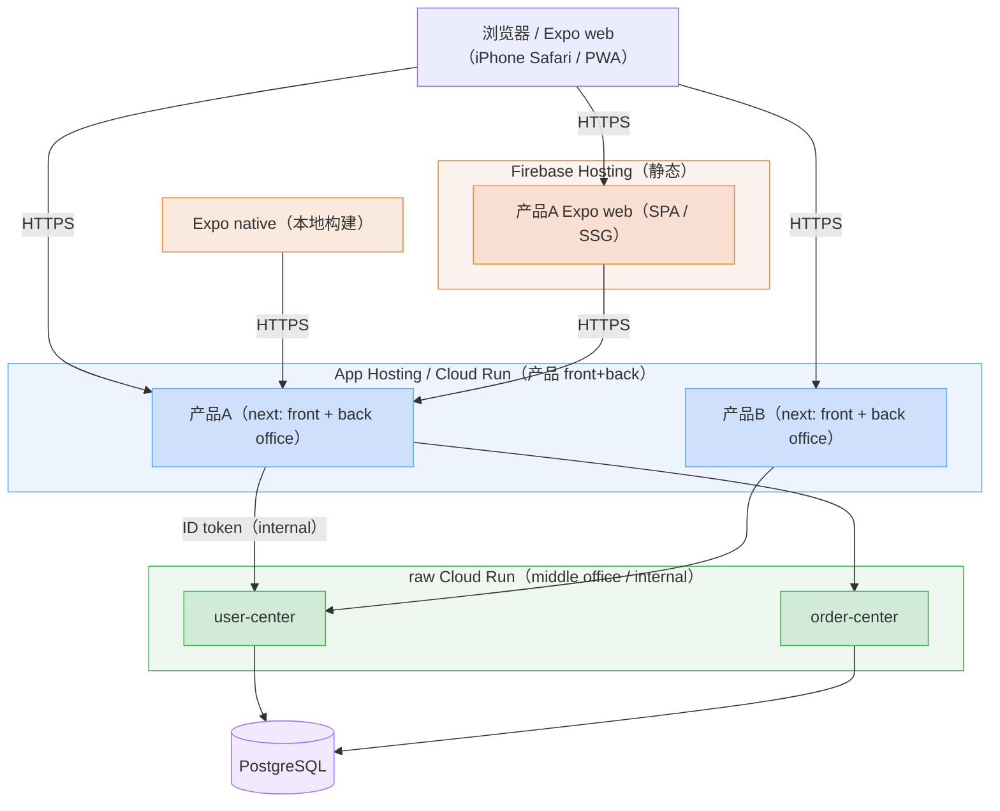
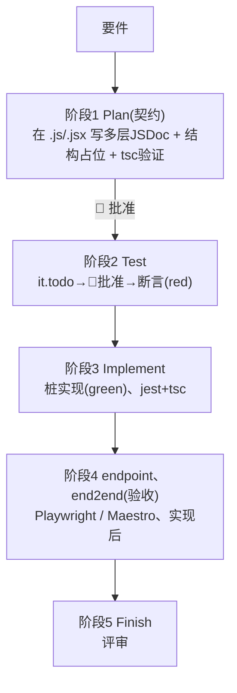
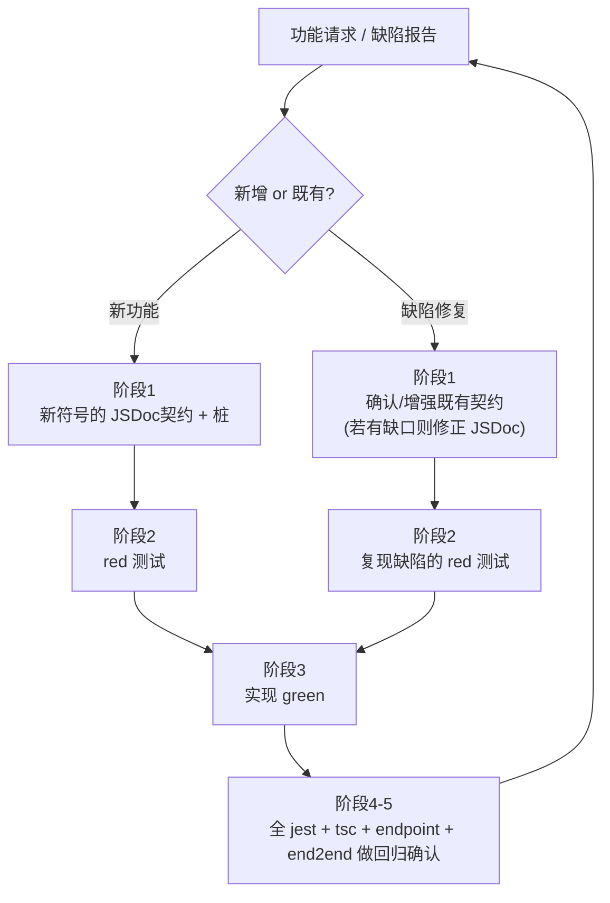
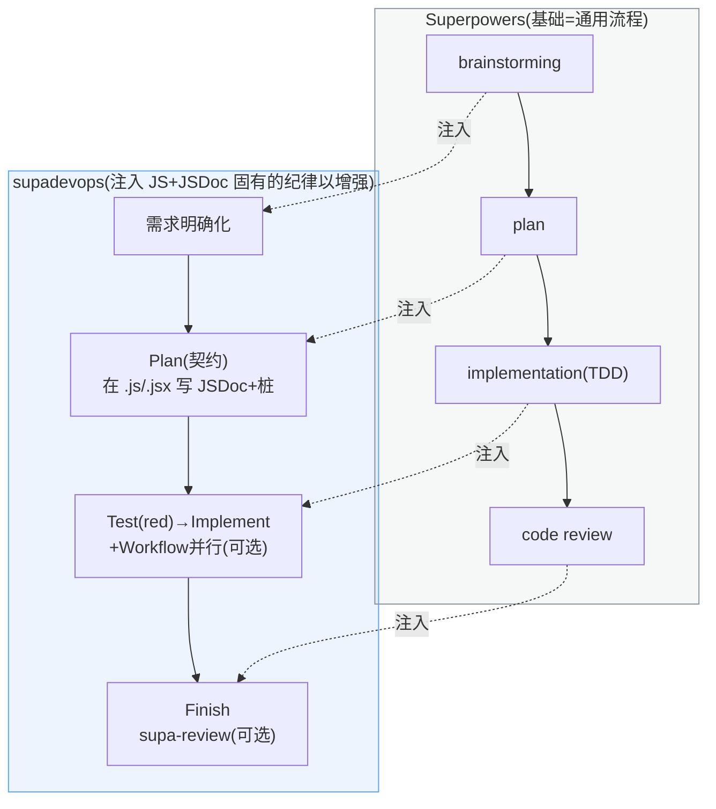
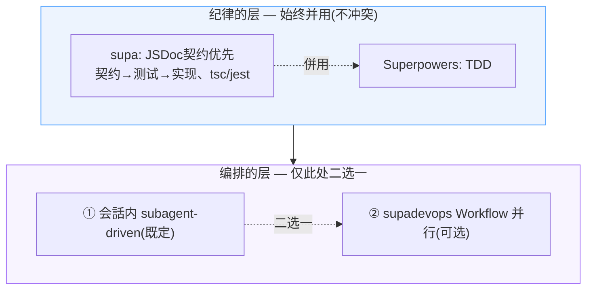
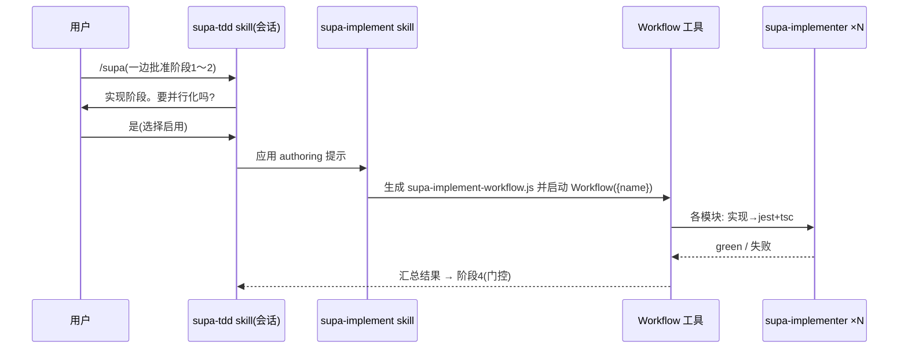
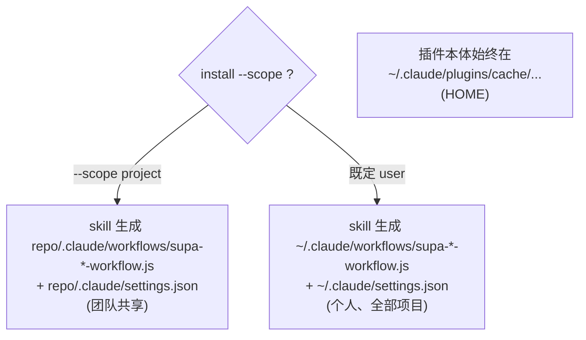

# supadevops 规约 — JSDoc 契约优先 + TDD 开发流程

本规约规定 Claude Code 插件 **supadevops** 所施加的开发流程。supadevops 增强 Superpowers，在使用 Claude Code 进行 **Next.js（App Router）/ Expo（React Native）** 开发时，先于实现用 JSDoc 确定契约。对象是 **npm workspaces 的 monorepo**（`app/*` 下的各应用 + `package/*` 下的共享库群），`/supa-init` 命令以固定 tag 取得冻结模板 `magcen-zone/supa-starter`（degit）并确定性重命名，构建对部署保持中立的脚手架（§6）。**插件对部署保持中立**，deploy 到何处由开发者自行裁量（参考结构见 §1.4 末尾）。以契约为起点，**单元（辅助函数、Server Action）采用 test-first（red → green），endpoint、end2end（API、UI）作为实现后的验收测试**来验证（§2.1），并对各阶段施加人工门控。功能新增、缺陷修复以本流程为一个循环进行迭代，每个循环均为回归安全（§2.2）。本书为两部构成：第 I 部为方法论（§1–§4），第 II 部为 supadevops 插件的构建与分发（§5–§8）。

---

# 第 I 部 — 开发流程（方法论）

## 1. 前提与原则

### 1.1 前提

| 项目 | 规定 |
|---|---|
| 语言、类型 | JavaScript + JSDoc。类型全部以 JSDoc（`@typedef` / `@param` / `@returns` 等）记述。不创建 `.d.ts`。类型检查用 `tsc`（不输出） |
| 模块 | ESM（`import` / `export`，`package.json` 中 `"type": "module"`） |
| 仓库形态 | **npm workspaces 的 monorepo**。root 有 `package.json`（`"workspaces": ["app/*", "package/*"]` + scripts）/ `package-lock.json` / `node_modules`（主要 hoist 到 root）。`app/*` 放各应用，`package/*` 放共享库群（结构见 §1.4） |
| 对象 | 适用 supadevops 的 monorepo。可并置 `app/next-<名>`（Next.js `src/app`）与 `app/expo-<名>`（Expo）。契约、验证施加于全部应用、全部代码（按代码种别的手段见 §3.6，结构见 §1.4）。**插件对部署保持中立**（部署目标由开发者裁量，§1.4 末尾为参考） |
| 目录 | 各 Next.js 应用为 `src/` 结构：`src/helper/`（纯函数）/ `src/action/`（Server Action，使用时）/ `src/component/`（组件）/ `src/type/`（共享 `@typedef`）/ `src/app/`（page、layout、`api/**/route.js`）。Expo 应用以 Expo Router（`app/`）+ `src/helper` 等分离逻辑。`package/*` 的各共享库**仅含与平台无关的逻辑、类型**（§3.6）。测试见 §3.4 |
| 测试 | 单元 = Jest（Expo 为 jest-expo），endpoint = Playwright `request`，end2end = Playwright（web、Expo web）/ Maestro（Expo native） |
| 文档 | Markdown + Mermaid |
| 依赖 | 依赖 Superpowers（不内置）。在 `plugin.json` 的 `dependencies` 中声明（§8） |

> 补充：横切类型在各应用的 `src/type/`（若跨应用共享则放 `package/*` 的库）以 JS+JSDoc 的 `@typedef` 汇总（模块固有类型放在该文件内即可）。Server Action 是**带有 `'use server'` 的函数/文件**，汇总于 `src/action/`（`src/action/` 中不放 Server Action 以外的普通模块）。`package/*` 的共享库可能被 Next.js（React DOM）与 Expo（React Native）双方 import，因此**不放 React DOM 专用的 `.jsx` 组件**，仅限 framework 无关的逻辑、类型、hooks、API 客户端（§3.6）。root 直下的 `app/`（应用束）与 Next.js 的 `src/app/` 或 Expo Router 的 `app/` 层级不同，`workspaces` 的 glob 仅匹配直下（不会冲突）。

### 1.2 设计原则

1. **契约优先** — 先于实现确定 JSDoc 契约。
2. **多层、详细的 JSDoc** — 在 module / class / function / method / component props / `@typedef` 各层记述 `@param` / `@returns` / `@throws` 与意图。实现向此契约收敛。
3. **Plan 直接生成真实文件** — 不持有另外的 manifest。在阶段1向目标 `.js / .jsx`（辅助函数等的 `.js` 与组件的 `.jsx`）直接记入契约与结构占位符。位置以文件内顺序（§3.1）确定，不依赖行号。
4. **粒度为模块单位** — 契约、测试、实现以模块（`.js / .jsx`）为单位整体进行，不按函数单位切分。
5. **进度体现在真实文件中** — 未实现以 `throw` 桩表示。不在另外的文件中重复管理进度。
6. **人工门控** — 在前一阶段被批准之前不进入下一阶段。
7. **增强 Superpowers** — 能做到的事不重新实现，直接使用（§4）。

### 1.3 术语

- **契约** — 由 JSDoc 给出的类型（`@param` / `@returns` / `@typedef` 等）与一行意图（行为）。记于 module / class / function / component props 各层。
- **桩** — 仅持有契约、本体为 `throw new Error('not implemented')` 的声明。
- **纪律** — supa 所施加的 JS+JSDoc 固有规则（契约优先、`tsc`/`jest` 验证、放置规约）。
- **回归安全** — 由循环的完成条件“全部测试 + 类型检查为绿”所保证、以前为绿的行为不会被破坏的性质（§2.2）。
- **辅助函数** — 从 UI / Route Handler 提取的纯函数（framework 无关、确定性）。放于 `src/helper/`，以 Jest 单元测试。
- **Route Handler** — `src/app/api/**/route.js`。调用公共服务、外部服务的轻薄 API 边界（BFF）。以 endpoint 验证。
- **Server Action** — 带有 `'use server'` 的函数。从 React 的表单/客户端调用的 **UI 变更手段**，**仅存在于持有 UI（表单）的 next 应用中**（是否使用为可选。默认的变更系统是 Route Handler）。汇总于 `src/action/`，作为函数以 Jest（公共服务、外部服务的 HTTP 用 MSW mock）验证（纯粹部分提取到辅助函数）。
- **公共服务** — 自有内部共享的**内部**服务（= §1.4 参考的 middle office）。由 Route Handler（BFF）代理调用。测试中以 stub 替换（endpoint 用 env stub，Server Action 用 MSW）。实体、放置、部署不在插件关注范围（开发者裁量。参考见 §1.4 末尾）。
- **外部服务** — **第三方**的外部服务。由 Route Handler / Server Action 调用。测试中以 stub / mock 替换。本书中并记“公共服务、外部服务”的地方指二者。
- **monorepo** — 用 npm workspaces 将多个应用（`app/*`）与共享库群（`package/*`）束于一仓库的结构（§1.4）。任务（typecheck / test / lint / build）以 npm workspaces（`npm run <task> --workspaces --if-present`）横跨执行，gate 为 `npm run check`（= typecheck && test）。无 turborepo（JS+JSDoc 无构建产物、全量 sub-second）。
- **Expo 应用** — Expo（React Native）制的应用（`app/expo-<名>`）。从一份代码库获得 **native**（iOS / Android）与 **web**（`expo export -p web`。以 `web.output` 得 SPA / SSG）的 build 输出（deploy 目标插件不关注）。
- **endpoint** — 用 Playwright `request` 验证 Route Handler（API）的测试（无浏览器，公共服务、外部服务在 dev 服务器上 stub）。放置见 §3.4。
- **end2end** — 验证 UI / 浏览器、画面流程的测试（web、Expo web 用 Playwright，Expo native 用 Maestro）。放置见 §3.4。
- **red / green** — 测试失败 / 成功的状态（TDD）。
- **断言（assertion）** — 验证期望结果的语句（`expect(...)` 等）。
- **驱动角色** — 推进实现的主体。会话内 subagent 或 supadevops 的 Workflow（§4.1）。
- **Workflow** — Claude Code 的本体功能。以 JS 脚本并行/串行执行 subagent。supadevops 的 `supa-<功能>-workflow.js` 即此 Workflow 脚本（§5）。

### 1.4 对象 monorepo 的结构

supadevops 以 **npm workspaces 的 monorepo** 为单位适用。一个 monorepo 束起多个应用（`app/*`）与共享库群（`package/*`），`/supa-init`（§6）以固定 tag 取得冻结模板 `magcen-zone/supa-starter`（degit）并由内置脚本确定性重命名，构建**对部署保持中立的脚手架**。**插件对部署保持中立**，不关注部署目标、网络、服务间认证、应用的角色划分（这些由开发者裁量。本社的参考结构见本节末尾）。

#### monorepo 的结构（规范）

- root 为 npm workspaces（`"workspaces": ["app/*", "package/*"]`）。root `package.json` 的 scripts 以 `npm run <task> --workspaces --if-present` 横跨执行 typecheck / test / lint / build，gate 为 `npm run check`（= typecheck && test）。**无 turborepo**（JS+JSDoc 无构建产物、全量 sub-second）。
- `app/*` 放各应用。可并置 `app/next-<名>`（Next.js `src/app`）、`app/expo-<名>`（Expo），并按需放多个（API 专用的 next 也同列。插件不区分角色）。
- `package/*` 放共享库群（不限于一个）。各库**仅含与平台无关的逻辑、类型**（helper / type / hooks / API 客户端）。由于可能被 Next.js（React DOM）与 Expo（React Native）双方 import，故不放 React DOM 专用 `.jsx`（§3.6）。
- 各应用、各库持有自己的 `package.json`（仅自己的依赖）、`jsconfig.json`（§3.5），内部遵循 §1.1 的目录规约。`package.json` / `package-lock.json` / `node_modules` 由 **npm 生成**（不手写）。`node_modules` 主要 hoist 到 root。
- build / export（dev、测试用）：Expo native 用 `expo prebuild` + `expo run:ios` / `run:android`（本地构建），Expo web 用 `expo export -p web`（以 `app.json` 的 `web.output` 选 `single`=SPA / `static`=SSG。`server`〔SSR/API routes〕现状超出范围〔将来支持。预留 `src/endpoint/`、`src/action/`〕），Next.js 用 `next build`。**成果物 deploy 到何处插件不关注**。

```
<repo>/                            # monorepo（npm workspaces）
├─ package.json                    # "type":"module", workspaces + scripts(typecheck/test/check/build)
├─ package-lock.json               # npm 生成
├─ node_modules/                   # hoisted（主要在 root）
├─ app/
│  ├─ next-shop/                   # create-next-app（JS、src/app）
│  │  ├─ package.json              # "type":"module"
│  │  ├─ next.config.js            # ESM(.js)。transpilePackages: 取入 package/*（§3.7）
│  │  ├─ jest.config.js / playwright.config.js
│  │  ├─ jsconfig.json             # checkJs + types:["node"]（§3.5）
│  │  └─ src/
│  │     ├─ helper/ action/ component/ type/
│  │     ├─ app/                   # page、layout、api/**/route.js
│  │     ├─ endpoint/              # endpoint（Playwright request）
│  │     └─ end2end/               # end2end（web、Playwright）
│  ├─ expo-shop/                   # create-expo-app（既定 TS→JS+JSDoc 化）
│  │  ├─ package.json              # "type":"module"
│  │  ├─ app.json                  # web.output: single | static（将来也含 server）
│  │  ├─ metro.config.cjs          # CJS（Metro 同步加载配置，ESM 不可）
│  │  ├─ babel.config.cjs          # CJS（Babel 同步加载，ESM 会抛错）
│  │  ├─ jest.config.js / playwright.config.js
│  │  ├─ jsconfig.json
│  │  └─ src/                      # 与 Next 同形（endpoint/ action/ 为将来 SSR 预留）
│  │     ├─ helper/ action/ component/ type/
│  │     ├─ app/                   # Expo Router 画面（src/app）
│  │     ├─ endpoint/              # 将来 SSR（web.output:'server'）的 API routes 用
│  │     └─ end2end/
│  │        ├─ web/                # Playwright
│  │        └─ native/             # Maestro（*.yaml）
│  └─ gas-ops/                     # Google Apps Script（与 next/expo 同构：src/app=push 入口）
│     ├─ package.json              # "type":"module"
│     ├─ jest.config.js
│     ├─ vendor-pack.js            # esbuild 入口：re-export 依赖 + 本地 src/helper（→ src/app/vendor.js）
│     ├─ .clasp.json               # rootDir: src/app
│     ├─ jsconfig.json
│     └─ src/                      # 与 next/expo 同形（end2end 扁平，无 web/native）
│        ├─ helper/ action/ component/ type/   # 纯逻辑（Jest 固化，经 vendor-pack 注入运行时）
│        ├─ app/                   # GAS 入口(doGet/触发器)+appsscript.json+vendor.js（打包出力=push 对象）
│        ├─ endpoint/              # doGet/doPost web app 的受入（可选）
│        └─ end2end/               # 扁平（GAS 无 web/native 区分）
└─ package/                        # 共享库群（可多个）
   ├─ order/                       # 例: 平台无关逻辑、类型
   │  ├─ package.json
   │  └─ src/
   │     ├─ helper/
   │     └─ type/
   └─ api-client/
      └─ …（同構成）
```

#### 参考：部署与分层结构（非规范、开发者裁量、插件不关注）

> 以下不是 supadevops 的规范。部署目标、网络、ingress、IAM、应用的角色划分（产品 / 共享服务）属于开发者的运维裁量，插件保持中立、不关注。作为本社的结构示例供参考（平台的最终行为以 Google Cloud / Firebase / Expo 官方文档为准。EAS / Vercel 本社不使用）。

本社将同一 monorepo 的应用按角色看作 3 层：**front office**（面向用户的 UI。`app/next-<名>` 的 page/layout、`src/component`，以及 `app/expo-<名>`）/ **back office**（同一产品的 Route Handler `app/next-<名>/src/app/api/**/route.js`）/ **middle office**（被多个产品复用的共享 API。在另一仓库的同形状 monorepo 中并置 `app/next-<svc>`）。浏览器、移动端仅与 front / back office 通信，对 middle office 由 back office 在服务器间代理（不对外公开）。

| 应用（例） | 角色 | 部署目标（例） | 构建 | ingress |
|---|---|---|---|---|
| `app/next-<名>`（产品 front+back） | UI + BFF | Firebase **App Hosting** 或 raw **Cloud Run** | Cloud Build / buildpacks | 公开 + CDN |
| `app/expo-<名>`（native） | iOS / Android | **本地 macOS 构建**（Xcode / Android SDK） | 本地 | 设备（分发为手动 / 商店） |
| `app/expo-<名>`（web） | SPA / SSG | Firebase **Hosting** | `expo export -p web` → `dist/` | 公开 |
| `app/next-<svc>`（middle office） | 共享 API | raw **Cloud Run** | buildpacks | internal |



部署步骤（参考）：

- **产品 next → App Hosting / Cloud Run** — 创建 App Hosting 后端时将 **Root directory 指向 `app/next-<名>`**（monorepo 支持。workspace 依赖 `package/*` 也一并构建）。此后 `git push` 即 Cloud Build → buildpacks → Cloud Run → CDN。运行时配置在 `app/next-<名>/apphosting.yaml` 的 `runConfig`。若直接发到 Cloud Run 则用 `gcloud run deploy <名> --source app/next-<名> --region <region>`。
- **Expo native → 本地 macOS 构建** — 在 `app/expo-<名>` 执行 `expo prebuild` 后 `expo run:ios`（Xcode）/ `run:android`（Android SDK）。分发为手动（TestFlight / 商店 / 内部）。
- **Expo web → Firebase Hosting** — 用 `expo export -p web` 生成 `dist/` 后 `firebase deploy --only hosting`（将 `firebase.json` 的 `hosting.public` 指向 `dist/`，SPA 用 rewrites 回退到 index）。
- **middle office next → raw Cloud Run** — `gcloud run deploy <svc> --source app/next-<svc> --region <region> --ingress internal --no-allow-unauthenticated`。`next.config` 为 `output: 'standalone'`。若需要 sidecar 则用 `service.yaml` + `gcloud run services replace`（App Hosting 不支持 sidecar）。

配置、认证（参考）：

- 配置文件 `apphosting.yaml` / `service.yaml` / `firebase.json` 在保持扩展名（`.yml` / `.yaml` / `.json`）的同时以 JSON 语法记述内容（YAML 是 JSON 的超集）。
- middle office 设为 ingress internal，来自 back office 的调用以服务账号 + ID token（IAM、Cloud Run 原生 service-to-service）认证。

> 与测试的对应：“Route Handler / Server Action 调用公共服务、外部服务的地方在测试中替换”（§3.6）。endpoint 用 env stub，Server Action 用 MSW。

---

## 2. 开发流程（5阶段）

先在真实 `.js / .jsx` 记入契约，让测试与实现向其收敛。不跳过顺序。



| 阶段 | 工作 | 门控 |
|---|---|---|
| **1 Plan（契约）** | 创建目标 `.js / .jsx`（辅助函数等的 `.js` 与组件的 `.jsx`），直接记入多层 JSDoc（module / class / function / method / component props / `@typedef`）与结构占位符（本体为 `throw new Error('not implemented')`）。用 `tsc -p jsconfig.json --noEmit` 验证类型契约 | 🚧 批准 |
| **2 Test（red）** | 针对 JSDoc 契约编写 Jest。用 `it.todo` 列举验证项 → 🚧批准 → 填入断言使其变为 **red**（§3.3） | 🚧 批准（it.todo） |
| **3 Implement（green）** | 以模块为单位实现桩本体，使 `jest` 与 `tsc` 变绿（并行加速见 §5） | — |
| **4 验收（endpoint、end2end）** | 将 endpoint 与 end2end 作为**验收测试**追加（实现后）。endpoint 对全部 Route Handler 用 Playwright `request`（公共服务、外部服务用 env stub 的 dev 服务器）。end2end 施加于全部 next 路由（page/layout）与 Expo 的全部画面：web、Expo web 用 Playwright，Expo native 用 Maestro（§3.6） | — |
| **5 Finish** | 进行评审，确认未实现桩没有残留 | — |

### 2.1 契约的验证

契约以 3 个系统验证：类型（`tsc`）、行为（Jest：辅助函数、Server Action、Expo 逻辑、共享库）、外部验收（endpoint、end2end）。阶段2 的 Jest 验证的是行为而非类型。

| 契约 | 内容 | 验证手段 | 时机 |
|---|---|---|---|
| **类型契约** | JSDoc 签名（`@param` / `@returns` / `@typedef`） | `tsc -p jsconfig.json --noEmit` | 阶段1 之后起常时（静态） |
| **行为契约** | 意图（函数 / 方法做什么） | Jest | 阶段2 为 **red**，阶段3 为 **green** |
| **外部验收** | API / UI 的外形行为 | endpoint、end2end（Playwright / Maestro） | 阶段4（实现后的验收） |

- Jest import 辅助函数，以符合契约 `@param` 类型的输入（带类型的 fixtures）调用，并 assert `@returns` 与意图。Server Action 将公共服务、外部服务的 HTTP 用 MSW mock 后调用，assert 结果（§3.6）。Expo 的逻辑以 jest-expo 同样验证。
- 实现前因桩会 `throw` 而为 red，实现后为 green。
- 测试针对契约的接口编写，实现满足契约。
- **test-first 仅限 Jest 对象（辅助函数、Server Action、Expo 逻辑、共享库）**（endpoint、end2end 为实现后的验收）。类型契约（`tsc`）对全部代码常时。

### 2.2 迭代循环（功能新增、缺陷修复）

每个功能请求、缺陷修复都将整个流程跑一个循环。循环的完成条件为“全部测试 + 类型检查为绿”，不破坏以前为绿的行为（回归安全）。



- **新功能** — 新符号的契约 → red → green → 回归确认。
- **缺陷修复** — 确认既有契约（若不足则增强 JSDoc），加入复现缺陷的 red，修复后 green，回归确认。
- 测试不丢弃，作为回归套件累积，每个循环全量执行。
- 回归安全由下列保证：
  - 在完成前使 `npm run check`（= typecheck && test，经 npm workspaces 跑全工作区的 `tsc -p jsconfig.json --noEmit` + `jest`〔含 jest-expo〕）变绿（`Stop` 钩子自动确认。§6）。endpoint、end2end（Playwright / Maestro）较重且非交互，故不纳入 Stop，在阶段4 验收（+可选的 CI）中执行。
  - 修复的缺陷以 red→green 测试恒久化，防止复发。

---

## 3. 规约

### 3.1 文件内的标准顺序

```
1. import
2. @typedef
3. export 函数 / class(依赖顺 / 声明顺)
4. 非公开 helper(末尾，或最初使用处的正下方)
```

`.jsx` 也为同顺序（组件作为带 props 类型 JSDoc 的 export 函数置于 `4.`）。`5.` 的非公开 helper 是生产代码，不是测试。测试放在另外的文件（§3.4）。

**说明仅以 JSDoc（`/** ... */`）记述，且必须为多行块形式（`/**` / ` * @tag …` / ` */` 各占一行）置于对象代码正上方（不写一行式 `/** @type {X} */`，也不写在代码同行末尾）。** 不写说明代码行为的行内注释（`//`）。例外仅为机械式指令（`'use server'` / `'use client'`）。

### 3.2 契约的记述（阶段1 的输出）

在真实 `.js / .jsx` 以 ESM 直接记入契约与桩（辅助函数等为 `.js`，React 组件为 `.jsx`。组件以 JSDoc 为 props 标注类型，§3.6）。记述各 `@param` / `@returns` / `@throws` 与意图，桩本体为 `throw new Error('not implemented')`。

```js
/**
 * 订单的金额计算、验证辅助函数(纯函数)。
 * @module helper/order
 */

/**
 * @typedef {object} OrderItem
 * @property {string} sku - 商品代码
 * @property {number} qty - 数量(>=1)
 */

/**
 * @typedef {object} Order
 * @property {string} id
 * @property {OrderItem[]} items
 * @property {number} total - 合计金额(含税)
 * @property {'pending'|'paid'|'cancelled'} status
 */

/**
 * 从明细组装新订单(纯粹。不做持久化)。
 * @param {OrderItem[]} items - 1 条以上的明细
 * @returns {Order} status='pending' 的新订单
 * @throws {RangeError} 当 items 为空时
 */
export function buildOrder(items) {
  throw new Error('not implemented');
}

/**
 * 保持明细并计算合计的纯粹聚合(不持有 I/O)。
 */
export class Cart {
  /**
   * @param {OrderItem[]} items
   */
  constructor(items) {
    throw new Error('not implemented');
  }

  /**
   * 返回合计金额(含税)。
   * @returns {number}
   */
  total() {
    throw new Error('not implemented');
  }
}

/**
 * 判定明细是否妥当(内部 helper、纯粹。不是测试)。
 * @param {OrderItem[]} items
 * @returns {void}
 */
function validateItems(items) {
  throw new Error('not implemented');
}
```

### 3.3 测试的记述（阶段2）

1. **先用 `it.todo` 列举验证项。** 批准后填入断言。`it.todo('说明')` 是没有本体的预定测试，Jest 将其作为 `todo` 保留显示（`it` = `test` = 1 个测试用例）。
2. **类型仅给会被复用的值标注。** 给 fixtures / factories / mocks / helpers 标注 JSDoc 类型，不给 `it(...)` 的回调本体标注。
3. **测试结构为 source 的镜像。** 1 个公开函数 = 1 个 `describe`，1 个行为 = 1 个 `it`。使覆盖与契约 1:1 对应。

术语：**fixture** = 固定样本数据 / **factory** = 测试数据生成函数 / **mock** = 依赖的替代 / **helper** = 多个测试共用的函数。

```js
describe('buildOrder', () => {
  it.todo('从明细构建订单且 status 为 pending');
  it.todo('items 为空则抛出 RangeError');
});
```

```js
import { describe, it, expect } from '@jest/globals';
import { buildOrder } from './order.js';

/**
 * 生成 OrderItem 的 factory(因会被复用故标注类型)。
 * @param {Partial<import('./order.js').OrderItem>} [overrides]
 * @returns {import('./order.js').OrderItem}
 */
const makeItem = (overrides = {}) => ({ sku: 'A1', qty: 1, ...overrides });

describe('buildOrder', () => {
  it('从明细构建订单且 status 为 pending', () => {
    const order = buildOrder([makeItem()]);
    expect(order.status).toBe('pending');
  });
  it('items 为空则抛出 RangeError', () => {
    expect(() => buildOrder([])).toThrow(RangeError);
  });
});
```

### 3.4 测试的放置

测试不记于业务文件，始终为另外的文件。测试层如下：

- **单元（Jest）** — 在实现文件旁放 `<name>.test.js`（辅助函数 `src/helper/order.js` ↔ `src/helper/order.test.js`，Server Action `src/action/checkout.js` ↔ `src/action/checkout.test.js`。Expo 逻辑用 jest-expo）。组件 / 画面不持有单元测试，行为以 end2end 验证（§3.6）。
- **endpoint（Playwright）** — 放于各 next 应用的 `src/endpoint/`（定义见 §1.3）。
- **end2end（web=Playwright）** — next 应用为 `src/end2end/`，Expo 应用为 `src/end2end/web/`（Expo 因 web/native 两个 runner 而将 `end2end/` 分割）。定义见 §1.3。
- **end2end（native=Maestro）** — 在 `app/expo-<名>/src/end2end/native/` 放 Maestro 流程（`*.yaml`）（`.yaml` 不在 tsc/jest 对象内）。对以 `expo prebuild` + `expo run` 导入模拟器的应用执行 `maestro test app/expo-<名>/src/end2end/native`（不纳入 `npm run check`，在阶段4 单独执行）。Maestro 流程因是 test DSL 而不在 house-rule“YAML 以 JSON 语法书写”的对象内（idiomatic Maestro YAML）。

```
app/next-shop/src/type/order.js            # 共有型(@typedef)
app/next-shop/src/helper/order.js          # 辅助函数(纯函数)
app/next-shop/src/helper/order.test.js     # Jest 单元 — 放在旁边
app/next-shop/src/action/checkout.js       # Server Action('use server'。纯粹部分提取到 helper)
app/next-shop/src/action/checkout.test.js  # Jest(函数、公共、外部服务的 HTTP 用 MSW mock)
app/next-shop/src/app/api/orders/route.js  # API(Route Handler)
app/next-shop/src/app/checkout/page.jsx    # page / 组件(.jsx)— 无单元测试(§3.6)
app/next-shop/src/endpoint/orders.spec.js  # endpoint(用 request 验证 Route、无需浏览器)
app/next-shop/src/end2end/checkout.spec.js # end2end(web、Playwright)
app/expo-shop/src/helper/cart.js           # Expo 逻辑
app/expo-shop/src/helper/cart.test.js      # jest-expo 单元
app/expo-shop/src/end2end/web/home.spec.js # end2end(Expo web、Playwright)
app/expo-shop/src/end2end/native/home.yaml # end2end(native、Maestro 流程)
package/order/src/helper/money.js          # 共享库(无依赖逻辑)
package/order/src/helper/money.test.js     # Jest 单元
```

依据：若在业务文件中混入测试，会混进生产 bundle，使 `tsc` / 评审 / 覆盖率计量变繁琐。另作文件则可切分“`tsc` 的对象 / Jest 的对象 / 生产 bundle”。

注：`.test`（Jest）、`.spec`（Playwright）是各 runner 的默认检测匹配器（spec = 源自 BDD 的“规约”），遵循惯例。

### 3.5 类型检查

类型检查以**每个工作区的 `jsconfig.json`** 进行（因 monorepo，program 为应用、库单位。以 `npm run typecheck`〔npm workspaces〕横跨）。靠 `jsconfig.json` 的 **`checkJs: true`** 将各工作区的整个 `src/`（helper / app / endpoint / end2end / component）作为一个 program 检查——`checkJs` 已覆盖 include 内所有 `.js / .jsx`，故 include 内**不需要每个文件开头的 `// @ts-check`**。本规范**完全不使用 per-file `// @ts-check`**（统一由 `checkJs` 把关）：include 之外的配置/脚本（`jest.config.js` / `next.config.js` / `playwright.config.js` / `babel`·`metro.config.cjs` 等）不纳入类型检查（trivial，可接受）。**扩展名规约：ESM 为默认——`type:module` 下一律 `.js`；`.mjs` 仅用于不被 `type:module` 覆盖的独立脚本（如插件的 `scripts/*.mjs`）；`.cjs` 仅用于「同步加载、不接受 ESM」的工具配置——Expo 的 `babel.config`（Babel 同步加载 ESM 会抛 "only supported when running Babel asynchronously"）与 `metro.config`（Metro 同步 require）。**

- 在 `jsconfig.json` 设置 `allowJs` + `checkJs` + `noEmit` + `jsx`（Next.js 设置）+ **`types: ["node"]`**（向 Next.js 生成的 `jsconfig.json` 加上 `checkJs` / `types`）。验证为 `tsc -p jsconfig.json --noEmit`（`tsc` 不会自动读取 `jsconfig.json`，故 `-p` 必需）。
- **测试类型统一为 import 来源** — Jest 从 `@jest/globals`、Playwright 从 `@playwright/test` import `test` / `expect`（§3.3）。若在全局 `types` 中同居 jest 与 playwright，二者会扩展 `expect` / `test` 而冲突，故停止全局注入、统一为 import 来源的类型。

类型写在 JSDoc 中故不创建 `.d.ts`。开发依赖为 `typescript` / `@types/node` / `@playwright/test` / `msw`（公共服务、外部服务的 HTTP mock）（JSX 类型检查用 `@types/react`，Expo 用 `jest-expo` 与 Expo / React Native 内置类型）。不使用 `@types/jest`（`@jest/globals` 内置类型）。**Maestro 是另外的 CLI**（不是 npm 依赖，需另行安装）。

### 3.6 按代码种别的测试

契约优先适用于全部代码。类型契约（JSDoc）由 `tsc` 对全部代码检查。行为测试按**代码种别**对应（不依赖角色或部署目标）：**辅助函数、Server Action、Expo 逻辑、共享库用 Jest（Expo 为 jest-expo），API（Route Handler）用 endpoint，UI 用 end2end**。end2end 中 **web、Expo web 为 Playwright，Expo native 为 Maestro**。**test-first 仅限 Jest，endpoint、end2end 作为实现后的验收测试**（§2.1）。**全部 next 路由（page/layout）与 Expo 的全部画面无例外地作为 end2end 的对象**（施加于各 page，layout 经由其下路由验证。不持有 UI 的 API 专用 next 应用仅 endpoint 与 Jest）。**不使用** RTL / jsdom 的组件单元测试（与 end2end 重复，也可回避 async Server Component 的约束）。

| 代码种别 | 类型契约 | 行为测试 |
|---|---|---|
| 辅助函数（纯函数。`src/helper/`） | JSDoc（`@param` / `@returns` / `@typedef`）→ `tsc` | **Jest 单元**（assert 返回值、异常） |
| Server Action（`src/action/`、使用时） | JSDoc → `tsc` | **Jest 单元**（作为函数直接 import，公共服务、外部服务的 HTTP 用 MSW mock）。纯粹部分提取到 `src/helper/` 辅助函数 |
| Route Handler（API。`src/app/api/`） | JSDoc → `tsc` | **endpoint**（Playwright `request`，公共服务、外部服务用 env stub 的 dev 服务器，无浏览器） |
| React 组件 / page / layout（next UI） | 以 JSDoc 为 props 标注类型 → `tsc` | **end2end**（Playwright、浏览器） |
| Expo 逻辑（helper、hooks。`app/expo-*/src/`） | JSDoc → `tsc` | **Jest 单元（jest-expo）** |
| Expo UI — web（SPA / SSG） | 以 JSDoc 为 props 标注类型 → `tsc` | **end2end（Playwright）**（针对 `expo export -p web` / dev 服务器） |
| Expo UI — native（画面、组件） | 以 JSDoc 为 props 标注类型 → `tsc` | **end2end（Maestro）**（针对本地构建 / 模拟器） |
| 共享库（`package/*`、无依赖逻辑） | JSDoc → `tsc` | **Jest 单元** |

- Route Handler、Server Action、组件、画面保持轻薄，将确定性的判断、计算（不含 framework API〔`cookies()`、`revalidatePath()` 等〕或 I/O 的处理）提取到 `src/helper/`（若共享则 `package/*`）的辅助函数并用 Jest 单元固化。Route Handler 设为调用公共服务、外部服务的轻薄 BFF 边界，UI 层仅限组合与显示。
- endpoint 针对 dev 服务器执行故不能用 in-process mock。**用 env 变量将公共服务、外部服务的 base URL 指向本地 stub 服务器**，以 Playwright 的 `webServer` 连同 dev 服务器一起启动来验证 Route Handler 的输入输出、路径（Server Action〔Jest〕用 MSW mock HTTP。另一手段）。
- 组件、Expo 画面的桩也以 JSDoc 为 props 标注类型，本体为 `throw`。Expo 的行为是将 framework 无关逻辑放到 `src/helper`（若共享则 `package/*`）并用 jest-expo 固化，native 画面用 Maestro（本地构建 / 模拟器），web 用 Playwright（`expo export -p web` 或 dev 服务器）做 end2end。另外 `src/endpoint/`、`src/action/` 是将来采用 SSR（`web.output:'server'`）时以与 Next 相同规约（endpoint / Jest）使用的预留位，现状范围内为空即可。

```jsx
/**
 * @param {{ order: import('@/type/order').Order, onCancel: () => void }} props
 */
export function OrderCard({ order, onCancel }) {
  throw new Error('not implemented');
}
```

- UI 用的追加测试依赖不需要。为类型需要 `@types/react` 与 `jsconfig.json` 的 `jsx`（Next.js 设置）。

Server Action（使用时）像 `src/action/checkout.js` 那样写成轻薄函数，纯粹部分放到辅助函数。它是**被 UI 调用的手段**：例如 checkout 页面的 `<form action={checkout}>` 调用 `checkout()`。若没有表单（UI）则没有调用方，故 Server Action 仅存在于持有 UI 的 next 应用中（不持有画面的 API 专用应用以 `/api/...` 的 Route Handler 公开）。公共服务用 `fetch` 直接调用，测试（`src/action/checkout.test.js`）不做 end2end 而**作为函数用 Jest** 进行，将到公共服务的 HTTP 用 **MSW** mock。

```js
'use server';

/**
 * 将已确定的订单发送至公共服务。
 * @param {import('@/type/order').OrderItem[]} items
 * @returns {Promise<{ id: string }>}
 */
export async function checkout(items) {
  throw new Error('not implemented');
}
```

```js
import { describe, it, expect, beforeAll, afterAll } from '@jest/globals';
import { setupServer } from 'msw/node';
import { http, HttpResponse } from 'msw';
import { checkout } from './checkout.js';

const server = setupServer(
  http.post('https://order.internal/orders', () => HttpResponse.json({ id: 'o1' })),
);
beforeAll(() => server.listen());
afterAll(() => server.close());

describe('checkout', () => {
  it('将订单发送至公共服务并返回 id', async () => {
    expect((await checkout([{ sku: 'A1', qty: 1 }])).id).toBe('o1');
  });
});
```

### 3.7 工具配置（monorepo 实现的前提）

实现时所需的、经过验证的最小配置：

- **root `package.json` scripts（无 turborepo）** — `typecheck` / `test` / `lint` / `build` 为 `npm run <task> --workspaces --if-present`（各 workspace 的 `tsc -p jsconfig.json --noEmit` / `jest` 等），`check` = `typecheck && test`。JS+JSDoc 无构建产物（tsc `--noEmit` + jest 直跑）、gate 全量 sub-second，故不引入 turbo 的缓存/并行。回归确认为 `npm run check`（Stop 钩子执行。§6）。
- **Next.js 的 workspace 取入** — 在 `next.config` 放 `transpilePackages: ['<package/* 的 name>']`（为 import 未转译的共享库所必需）。
- **Jest × ESM** — 因 `"type":"module"`，以 `NODE_OPTIONS=--experimental-vm-modules` 执行。next / `package/*` 用原生 Jest，Expo 用 `jest-expo` preset。
- **Expo × ESM** — 随 `"type":"module"` 统一，Metro / Babel 配置设为 `metro.config.cjs` / `babel.config.cjs`（CommonJS）（若为 `.js` 则被当作 ESM 而损坏）。
- **共享库的依赖声明** — 各应用在 `dependencies` 中以 `"<name>": "*"` 声明 `package/*`（由 npm workspaces 解析）。库名带 scope（例 `@app/order`）。
- **Expo 类型检查** — 以 `@types/react` 与 Expo / React Native 内置类型对 JSX 做 `tsc` 检查（§3.5）。

---

## 4. 与 Superpowers 的关系

supadevops 不替换 Superpowers 而增强它。向通用流程的各阶段注入 JS+JSDoc 固有的纪律（JSDoc 契约、`tsc`/`jest` 验证、并行实现）。



| Superpowers 的阶段 | 方针 |
|---|---|
| brainstorming | 直接使用 Superpowers |
| plan | 增强。在 Plan 中向真实 `.js / .jsx` 直接写 JSDoc 契约 |
| subagent-driven implementation | 向阶段1–3 注入纪律（§4.1） |
| code review | 直接使用 Superpowers。若需要 JS+JSDoc 特化则以 `supa-reviewer` 增强 |

契约桩是接口而非实现本体（本体仅 `throw`）。单元测试因先于实现编写（endpoint、end2end 为实现后的验收测试。§2.1），与 Superpowers 的“测试先行”原则兼容。

### 4.1 纪律常时并用、仅实现的驱动角色二选一



- 纪律（JSDoc 契约优先 + Superpowers TDD）始终并用。supa 的核心“代码前确定 JSDoc 契约”在任何实现方法下都适用。
- 二选一的只有实现的驱动角色：① 会话内 subagent-driven（默认）、② supadevops Workflow 并行（§5，可选）。
- 不得对同一组模块同时跑 ① 与 ②。

---

# 第 II 部 — 插件实现

## 5. Workflow 集成（实现阶段的并行加速）

supadevops 定义 3 个 Workflow，用于并行化不夹入人工门控的执行阶段（3 实现 / 4 验收 / 5 评审）。Workflow 是 Claude Code 本体功能，运行中不接受人工输入，故设为 1 Workflow = 1 阶段，人工门控由会话侧（skill）维持。在 monorepo 中将并行单位设为工作区内的模块 / 路由 / 画面，验证用各 workspace 的 `typecheck`/`test`（npm workspaces）进行。

| Workflow 文件 | 阶段 | 并行单位 |
|---|---|---|
| `supa-implement-workflow.js` | 3 实现 | 对 red 完成的独立模块逐一实现 → jest+tsc |
| `supa-acceptance-workflow.js` | 4 验收 | 对每个 Route Handler 做 endpoint，对 next 路由 / Expo web 做 Playwright end2end，对 Expo 画面做 Maestro |
| `supa-review-workflow.js` | 5 评审 | 按文件 / 维度评审 |



- **不内置模板。** 各 Workflow 遵循专用 skill（`supa-implement` / `supa-acceptance` / `supa-review`）所持的 authoring 提示，在选择启用（opt-in）时生成 `.claude/workflows/supa-<功能>-workflow.js` 并以 `Workflow({ name })` 启动（`workflow` 不是插件部件，故由作为部件的 skill 负责生成。放置范围见 §7）。
- **对象** — 独立模块（彼此无 import 依赖、并行实现不冲突者）3 个以上，且用户同意时。`args` 从含未实现桩的 `.js / .jsx`（`{ file, testFile }` 的数组）导出。
- **subagent** — 使用 `agentType: 'supa-implementer'`（实现、验收测试生成）、`supa-reviewer`（评审），内部也适用 JSDoc / `tsc` / `jest` 的纪律。

```js
export const meta = {
  name: 'supa-implement-workflow',
  description: '并行实现已完成 red 的模块并验证至 jest+tsc 转绿',
  phases: [{ title: 'Implement' }, { title: 'Verify' }],
}
const out = await pipeline(args,
  m => agent(`实现 ${m.file} 的桩本体并使 ${m.testFile} 转 green。ESM、不残留 throw。`,
             { agentType: 'supa-implementer', label: `impl:${m.file}`, phase: 'Implement' }),
  (_, m) => agent(`验证 ${m.file}: 执行 npm run typecheck -w <ws> && npm run test -w <ws>(jest + tsc)。失败则返回原因。`,
             { label: `verify:${m.file}`, phase: 'Verify', schema: VERDICT }))
return { results: out.filter(Boolean) }
```

---

## 6. 插件结构

```
supadevops/                               # GitHub: magcen-zone/supadevops 分发
├── .claude-plugin/
│   ├── plugin.json                    # name: supadevops / 依存: superpowers
│   └── marketplace.json               # name: magcen-zone / source "./"
├── skills/
│   ├── supa-tdd/                       # 核心(5阶段、门控、规约、填写示例)
│   ├── supa-implement/                 # F3 并行实现 Workflow 的 authoring 提示
│   ├── supa-acceptance/                # F4 并行验收 Workflow 的 authoring 提示
│   └── supa-review/                    # F5 并行评审 Workflow 的 authoring 提示
├── agents/
│   ├── supa-implementer.md             # 负责实现、验收测试生成
│   └── supa-reviewer.md                # 负责评审
├── hooks/
│   ├── hooks.json                     # Stop(验证)
│   └── validate.sh                    # npm run check（tsc + jest）
├── scripts/
│   └── rename-starter.mjs             # /supa-init 用: supa-starter 模板的确定性重命名引擎
├── commands/
│   ├── supa.md                         # /supa(启动开发流程)
│   └── supa-init.md                    # /supa-init(取得 supa-starter 模板 + 确定性重命名)
└── README.md
```

以 skill 为核心，内置 subagent / hook / command。`workflow` 不存在于插件的组件定义中，故不内置模板，由各 `supa-<功能>` skill 在需要时生成 `.claude/workflows/supa-<功能>-workflow.js` 以实体化（§5）。`/supa-init` 是命令，以固定 tag 取得冻结模板 `magcen-zone/supa-starter`（degit）、由内置的 `scripts/rename-starter.mjs` 确定性重命名占位名，再 `npm install` + `npm run check` 确认为绿。`create-next-app` / `create-expo-app` 与 Expo 的 TS→JS+JSDoc 转换现仅存在于该模板的维护/生成侧（§8），不在用户每次运行时（消除非确定性）。`app/gas-app`（Google Apps Script，与 next/expo 同构：`src/app` 为 push 入口）则为 `src/app` 的薄壳 GAS 全局脚本（doGet/触发器）+ 业务逻辑置于 `src/helper`（Jest 固化）经 `vendor-pack.js` re-export 由 esbuild 打包为 `src/app/vendor.js` + clasp push `src/app`，无 create-* 工序。

---

## 7. 命名、放置、分发

| 对象 | 名字 |
|---|---|
| 插件 / 核心 skill / 市场 | `supadevops` / `supa-tdd` / `magcen-zone` |
| Workflow skill（authoring） | `supa-implement` / `supa-acceptance` / `supa-review` |
| 生成的 Workflow | `supa-implement-workflow.js` / `supa-acceptance-workflow.js` / `supa-review-workflow.js`（`.claude/workflows/`） |
| subagent | `supa-implementer` / `supa-reviewer` |
| 命令 | `/supa`（启动开发流程）、`/supa-init`（monorepo 初始化） |

放置由 install 的 `--scope` 决定。插件本体始终放于 `~/.claude/plugins/cache/...`（HOME），仅生成的 Workflow 与声明的放置位置随 scope 变化。



声明在 `settings.json` 放 2 个 key。团队分发时并记 `extraKnownMarketplaces`，以 clone + 信任使手动 add 变得不必要。本社市场为 **github.com/magcen-zone**。

```json
{
  "extraKnownMarketplaces": {
    "magcen-zone": { "source": { "source": "github", "repo": "magcen-zone/supadevops" } }
  },
  "enabledPlugins": { "supadevops@magcen-zone": true }
}
```

---

## 8. 实现参考（已确认）

- **plugin.json** — `name` 必需。依赖为 `dependencies: [{ "name": "superpowers" }]`（字符串 `"superpowers"` 亦可）。
- **marketplace.json** — `name / owner / plugins[]`。`source` 必须以 `./` 开头的相对路径（与根同居为 `"./"`）。推荐 `metadata.description`。
- **组件** — `skills / agents / hooks / commands / .mcp.json / .lsp.json / monitors / output-styles`（不含 `workflows`）。
- **hooks** — `hooks/hooks.json`。supadevops 使用 `Stop`（验证），仅执行 `npm run check`（tsc + jest）（快速。endpoint/end2end 在阶段4）。命令中可用 `${CLAUDE_PLUGIN_ROOT}` / `${CLAUDE_PROJECT_DIR}`。
- **分发范围** — `claude plugin install <p>@<mp> --scope user|project`（放置目标、声明以 §7 为正本）。并记 `extraKnownMarketplaces` 即可团队自动解析。
- **Workflow** — `Workflow({ name })` 解析 `.claude/workflows/`，`Workflow({ scriptPath })` 执行任意 `.js`。`args` 以真实 JSON 传入。
- **init** — `/supa-init` 以固定 tag 取得冻结模板 `magcen-zone/supa-starter`（`degit magcen-zone/supa-starter#vX.Y.Z`），用内置 `scripts/rename-starter.mjs` 把占位名 `next-app` / `expo-app` / `gas-app` / `core`（`@app/core`）确定性重命名为项目名（目录 + 文件内 token + `app.json` + 锁文件 workspace 项；并删模板 README/LICENSE），再 `npm install`（非 `npm ci`，以保留外部依赖锁定）+ `npm run check` 确认为绿。模板已是 `npm run check` 为绿、无 `throw` 桩的实现就绪雏形。**`app/gas-app`（Google Apps Script，结构与 next/expo 统一）**：`src/app` 为 push 目标——手写 GAS 全局脚本（无模块语法）的薄壳入口 + `appsscript.json`；业务逻辑置于 `src/helper`·`src/action` 用 Jest 固化（与 next/expo 同一 TDD），连同 workspace `@app/*` + npm 依赖在 `vendor-pack.js` 单文件以命名空间声明（类型自动追従），经 esbuild 打包为 `src/app/vendor.js`（global `Vendor`，运行时经 `deps()` 访问）、`clasp` push `src/app`；含 placeholder `scriptId` 的 `.clasp.json`（`rootDir:"src/app"`）同梱，init 后绑定 scriptId + `npm run build` + `clasp push`（同 Expo native 属部署束缚、不在绿门控内）。**`create-next-app --js` / `create-expo-app`（默认 TS→JS+JSDoc 化：`.ts/.tsx`→`.js/.jsx`、JSDoc 化、`tsconfig`→`jsconfig`、`metro/babel`→`.cjs`、禁用 typed routes）与固有配置（`next.config` 的 `transpilePackages` / Expo `web.output`）现只在模板的一次性生成/再生成侧执行**（原最高风险工序移至维护者侧，并有 `npm run check` 把关）。模板版本由 `/supa-init` 以 tag 固定引用（建议与插件版本/tag 同步）。
- **中立性** — supadevops 对部署、托管保持中立，不以特定服务（EAS / Vercel / App Hosting / Cloud Run / Firebase Hosting 等）为前提。部署目标、网络、IAM、应用的角色划分由开发者裁量（§1.4 末尾为本社的参考例）。
