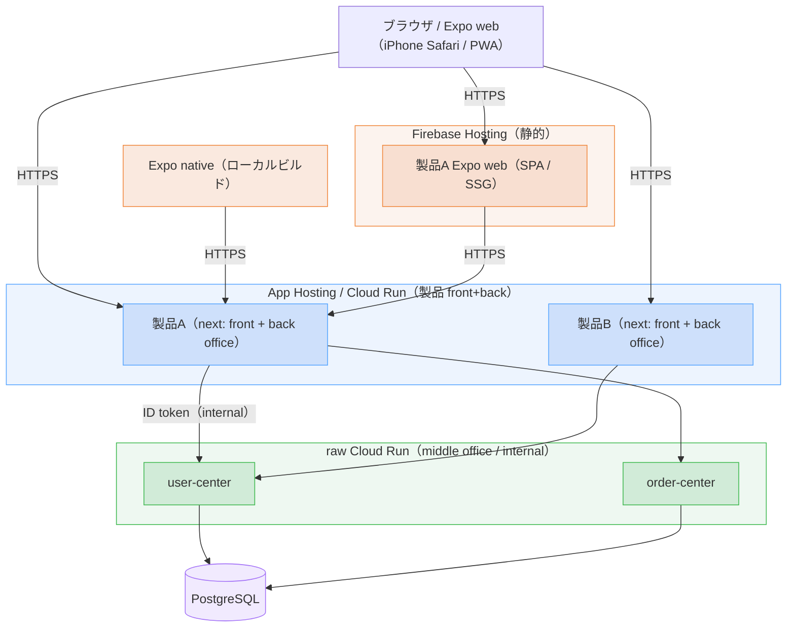
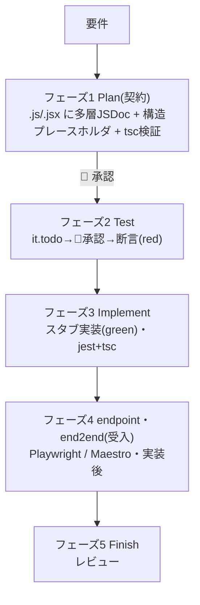
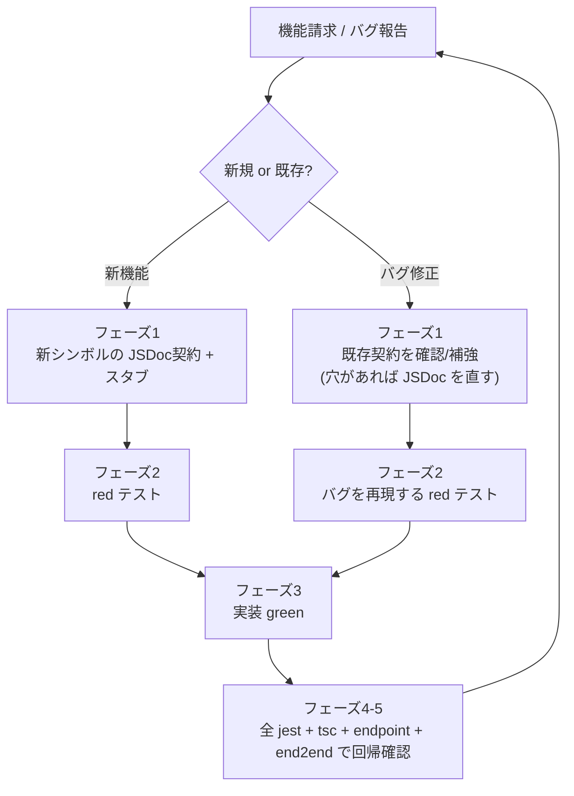
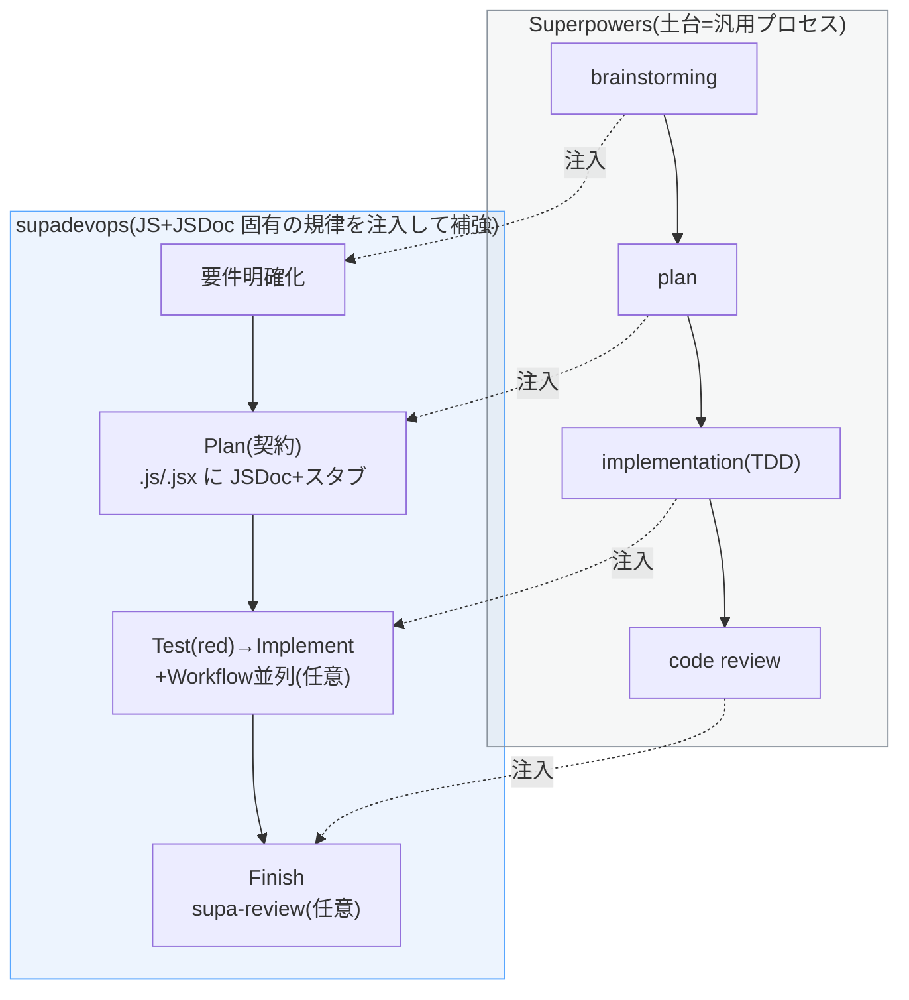
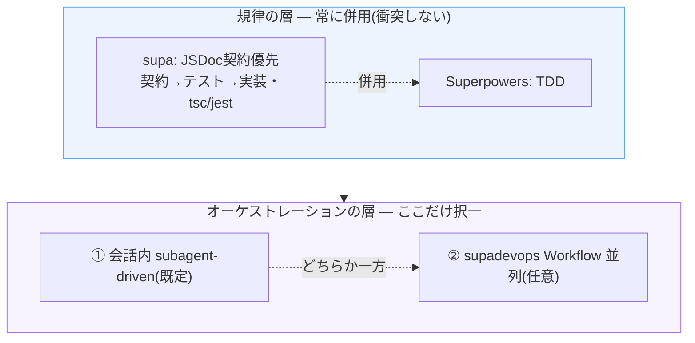
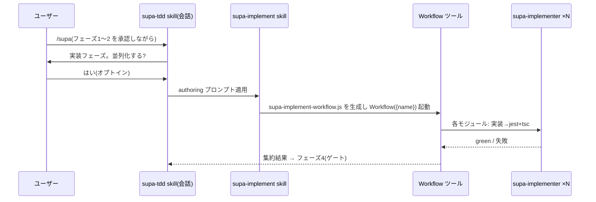
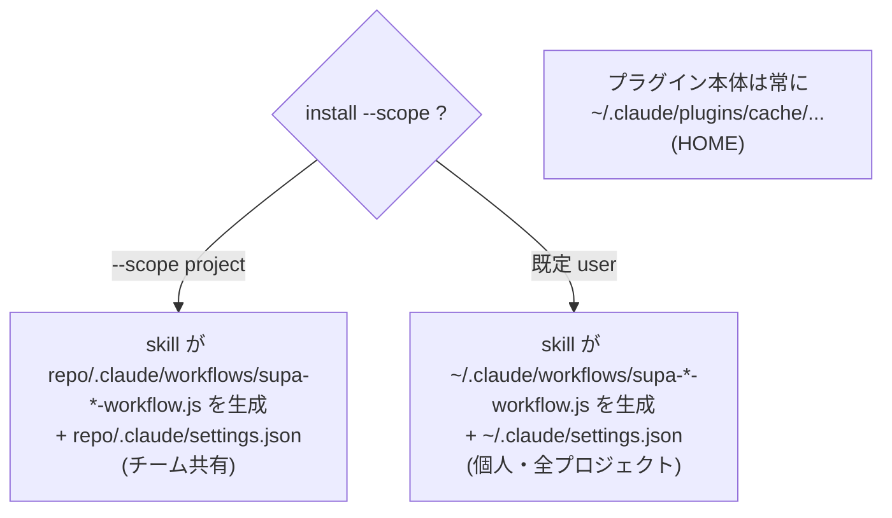

# supadevops 仕様 — JSDoc 契約優先 + TDD 開発フロー

本仕様は、Claude Code プラグイン **supadevops** が課す開発フローを規定する。supadevops は Superpowers を補強し、Claude Code による **Next.js(App Router)/ Expo(React Native)** 開発において、実装より先に JSDoc で契約を確定させる。対象は **npm workspaces + turborepo のモノレポ**(`app/*` の各アプリ + `package/*` の共有ライブラリ群)で、`/supa-init` コマンドが各アプリを公式 CLI で初期化して中立な足場を作る(§6)。**プラグインはデプロイに中立**で、どこへ deploy するかは開発者の裁量とする(参考構成は §1.4 末尾)。契約を起点に、**単体(ヘルパー・Server Action)は test-first(red → green)、endpoint・end2end(API・UI)は実装後の受入テスト**として検証し(§2.1)、各フェーズにヒューマンゲートを課す。機能追加・バグ修正は本フローを1サイクルとして反復し、各サイクルは回帰安全(§2.2)とする。本書は2部構成:第 I 部が方法論(§1–§4)、第 II 部が supadevops プラグインの構築・配布(§5–§8)。

---

# 第 I 部 — 開発フロー(方法論)

## 1. 前提と原則

### 1.1 前提

| 項目 | 規定 |
|---|---|
| 言語・型 | JavaScript + JSDoc。型はすべて JSDoc(`@typedef` / `@param` / `@returns` 等)で記す。`.d.ts` は作らない。型検査は `tsc`(出力なし) |
| モジュール | ESM(`import` / `export`、`package.json` に `"type": "module"`) |
| リポ形態 | **npm workspaces + turborepo のモノレポ**。root に `package.json`(`"workspaces": ["app/*", "package/*"]`)/ `package-lock.json` / `turbo.json` / `node_modules`(主に root へ hoist)。`app/*` に各アプリ、`package/*` に共有ライブラリ群(構成は §1.4) |
| 対象 | supadevops を適用するモノレポ。`app/next-<名>`(Next.js `src/app`)と `app/expo-<名>`(Expo)を並置できる。契約・検証は全アプリ・全コードに課す(コード種別ごとの手段は §3.6、構成は §1.4)。**プラグインはデプロイに中立**(デプロイ先は開発者裁量・§1.4 末尾の参考) |
| ディレクトリ | 各 Next.js アプリは `src/` 構成:`src/helper/`(純粋関数)/ `src/action/`(Server Action・使う場合)/ `src/component/`(コンポーネント)/ `src/type/`(共有 `@typedef`)/ `src/app/`(page・layout・`api/**/route.js`)。Expo アプリは Expo Router(`app/`)+ `src/helper` 等でロジックを分離。`package/*` の各共有ライブラリは**プラットフォーム非依存のロジック・型のみ**(§3.6)。テストは §3.4 |
| テスト | 単体 = Jest(Expo は jest-expo)、endpoint = Playwright `request`、end2end = Playwright(web・Expo web)/ Maestro(Expo native) |
| 文書 | Markdown + Mermaid |
| 依存 | Superpowers に依存(同梱しない)。`plugin.json` の `dependencies` で宣言する(§8) |

> 補足: 横断的な型は各アプリの `src/type/`(アプリ間で共有するなら `package/*` のライブラリ)に JS+JSDoc の `@typedef` で集約する(モジュール固有型はそのファイル内でよい)。Server Action は **`'use server'` を持つ関数/ファイル**で、`src/action/` に集約する(`src/action/` には Server Action 以外の通常モジュールを置かない)。`package/*` の共有ライブラリは Next.js(React DOM)と Expo(React Native)の双方から import されうるため、**React DOM 専用の `.jsx` コンポーネントは置かず**、framework 非依存のロジック・型・hooks・API クライアントに限る(§3.6)。root 直下の `app/`(アプリ束)は Next.js の `src/app/` や Expo Router の `app/` とは階層が異なり、`workspaces` のグロブは直下のみに一致する(衝突しない)。

### 1.2 設計原則

1. **契約優先** — 実装より先に JSDoc 契約を確定する。
2. **多層・詳細な JSDoc** — module / class / function / method / component props / `@typedef` の各層に `@param` / `@returns` / `@throws` と意図を記す。実装はこの契約に収束させる。
3. **Plan は実ファイルを直接生成する** — 別の manifest を持たない。フェーズ1で対象 `.js / .jsx`(ヘルパー等の `.js` とコンポーネントの `.jsx`)に契約と構造プレースホルダを直接記す。位置はファイル内順序(§3.1)で定め、行番号に依存しない。
4. **粒度はモジュール単位** — 契約・テスト・実装はモジュール(`.js / .jsx`)単位でまとめて行い、関数単位で刻まない。
5. **進捗は実ファイルに現れる** — 未実装は `throw` スタブで表す。進捗を別ファイルで二重管理しない。
6. **ヒューマンゲート** — 前フェーズが承認されるまで次へ進まない。
7. **Superpowers を補強する** — できることは再実装せず直接使う(§4)。

### 1.3 用語

- **契約** — JSDoc による型(`@param` / `@returns` / `@typedef` 等)と一行の意図(振る舞い)。module / class / function / component props の各層に記す。
- **スタブ** — 契約のみを持ち、本体が `throw new Error('not implemented')` の宣言。
- **規律** — supa が課す JS+JSDoc 固有の規則(契約優先・`tsc`/`jest` 検証・配置規約)。
- **回帰安全** — サイクルの完了条件「全テスト + 型検査が緑」により、以前緑だった挙動が壊れない性質(§2.2)。
- **ヘルパー** — UI / Route Handler から抽出した純粋関数(framework 非依存・決定的)。`src/helper/` に置き、Jest 単体でテストする。
- **Route Handler** — `src/app/api/**/route.js`。共通・外部サービスを呼ぶ薄い API 境界(BFF)。endpoint で検証する。
- **Server Action** — `'use server'` を持つ関数。React のフォーム/クライアントから呼ぶ **UI のミューテーション手段**で、**UI(フォーム)を持つ next アプリにのみ存在する**(使うかは任意。既定の変更系統は Route Handler)。`src/action/` に集約し、関数として Jest(共通・外部サービスの HTTP は MSW で mock)で検証する(純粋部はヘルパーへ抽出)。
- **共通サービス** — 自社で共有する**内部**サービス(= §1.4 参考の middle office)。Route Handler(BFF)が代理して呼ぶ。テストでは stub で差し替える(endpoint は env で stub、Server Action は MSW)。実体・配置・デプロイはプラグインの関与外(開発者裁量。参考は §1.4 末尾)。
- **外部サービス** — **第三者**の外部サービス。Route Handler / Server Action が呼ぶ。テストでは stub / mock で差し替える。本書で「共通・外部サービス」と併記する箇所は両者を指す。
- **モノレポ** — npm workspaces + turborepo で複数アプリ(`app/*`)と共有ライブラリ群(`package/*`)を1リポに束ねた構成(§1.4)。turbo がタスク(build / dev / lint / typecheck / test)をワークスペース横断で実行・キャッシュする。
- **Expo アプリ** — Expo(React Native)製のアプリ(`app/expo-<名>`)。1コードベースから **native**(iOS / Android)と **web**(`expo export -p web`。`web.output` で SPA / SSG)の build 出力を得る(deploy 先はプラグイン非関与)。
- **endpoint** — Route Handler(API)を Playwright `request` で検証するテスト(ブラウザ無し・共通・外部サービスは dev サーバで stub)。配置は §3.4。
- **end2end** — UI / ブラウザ・画面フローを検証するテスト(web・Expo web は Playwright、Expo native は Maestro)。配置は §3.4。
- **red / green** — テストが失敗 / 成功する状態(TDD)。
- **断言(assertion)** — 期待結果を検証する文(`expect(...)` 等)。
- **駆動役** — 実装を進める主体。会話内 subagent または supadevops の Workflow(§4.1)。
- **Workflow** — Claude Code の本体機能。JS スクリプトで subagent を並列/逐次実行する。supadevops の `supa-<機能>-workflow.js` はこの Workflow スクリプト(§5)。

### 1.4 対象モノレポの構成

supadevops は **npm workspaces + turborepo のモノレポ**単位で適用する。1モノレポは複数アプリ(`app/*`)と共有ライブラリ群(`package/*`)を束ね、`/supa-init`(§6)が公式 CLI と npm 命令で各アプリを初期化して**中立な足場**を作る。**プラグインはデプロイに中立**で、デプロイ先・ネットワーク・サービス間認証・アプリの役割区分には関与しない(それらは開発者裁量。本社の参考構成は本節末尾)。

#### モノレポの構成(規範)

- root は npm workspaces(`"workspaces": ["app/*", "package/*"]`)+ turborepo。`turbo.json` が build / dev / lint / typecheck / test をワークスペース横断で実行・キャッシュする。
- `app/*` に各アプリを置く。`app/next-<名>`(Next.js `src/app`)・`app/expo-<名>`(Expo)を並置でき、必要に応じて複数置く(API 専用の next も同列。プラグインは役割を区別しない)。
- `package/*` に共有ライブラリ群を置く(1つに限らない)。各ライブラリは **プラットフォーム非依存のロジック・型のみ**(helper / type / hooks / API クライアント)。Next.js(React DOM)と Expo(React Native)双方から import されうるため React DOM 専用 `.jsx` は置かない(§3.6)。
- 各アプリ・各ライブラリは自分の `package.json`(自分の依存のみ)・`jsconfig.json`(§3.5)を持ち、内部は §1.1 のディレクトリ規約に従う。`package.json` / `package-lock.json` / `node_modules` は **npm が生成**する(手書きしない)。`node_modules` は主に root へ hoist。
- build / export(dev・テスト用):Expo native は `expo prebuild` + `expo run:ios` / `run:android`(ローカルビルド)、Expo web は `expo export -p web`(`app.json` の `web.output` で `single`=SPA / `static`=SSG。`server`〔SSR/API routes〕は現状スコープ外〔将来対応。`src/endpoint/`・`src/action/` を予約〕)、Next.js は `next build`。**成果物をどこへ deploy するかはプラグイン非関与**。

```
<repo>/                            # モノレポ（npm workspaces + turborepo）
├─ package.json                    # "type":"module", "workspaces":["app/*","package/*"]
├─ package-lock.json               # npm が生成
├─ node_modules/                   # hoisted（主に root）
├─ turbo.json                      # build/dev/lint/typecheck/test のタスクパイプライン
├─ app/
│  ├─ next-shop/                   # create-next-app（JS・src/app）
│  │  ├─ package.json
│  │  ├─ next.config.js            # transpilePackages: package/* を取り込む（§3.7）
│  │  ├─ jsconfig.json             # checkJs + types:["node"]（§3.5）
│  │  └─ src/
│  │     ├─ helper/ action/ component/ type/
│  │     ├─ app/                   # page・layout・api/**/route.js
│  │     ├─ endpoint/              # endpoint（Playwright request）
│  │     └─ end2end/               # end2end（web・Playwright）
│  └─ expo-shop/                   # create-expo-app（既定 TS→JS+JSDoc 化）
│     ├─ package.json
│     ├─ app.json                  # web.output: single | static（将来 server も）
│     ├─ metro.config.cjs          # CJS（type:module のため）
│     ├─ babel.config.cjs          # CJS
│     ├─ jsconfig.json
│     └─ src/                      # Next と同形（endpoint/ action/ は将来 SSR 用に予約）
│        ├─ helper/ action/ component/ type/
│        ├─ app/                   # Expo Router 画面（src/app）
│        ├─ endpoint/              # 将来 SSR（web.output:'server'）の API routes 用
│        └─ end2end/
│           ├─ web/                # Playwright
│           └─ native/             # Maestro（*.yaml）
└─ package/                        # 共有ライブラリ群（複数可）
   ├─ order/                       # 例: プラットフォーム非依存ロジック・型
   │  ├─ package.json
   │  └─ src/ helper/ type/
   └─ api-client/
      └─ …（同構成）
```

#### 参考: デプロイと層構成(非規範・開発者裁量・プラグイン非関与)

> 以下は supadevops の規範ではない。デプロイ先・ネットワーク・ingress・IAM・アプリの役割区分(製品 / 共有サービス)は開発者の運用裁量であり、プラグインは中立で関与しない。本社の構成例として参考に記す(プラットフォームの最終挙動は Google Cloud / Firebase / Expo 公式文書を正とする。EAS / Vercel は本社では用いない)。

本社では同一モノレポのアプリを役割で 3 層に捉える:**front office**(ユーザー向け UI。`app/next-<名>` の page/layout・`src/component`、および `app/expo-<名>`)/ **back office**(同じ製品の Route Handler `app/next-<名>/src/app/api/**/route.js`)/ **middle office**(複数製品から再利用される共有 API。別リポの同形状モノレポに `app/next-<svc>` を並置)。ブラウザ・モバイルは front / back office とのみ通信し、middle office へは back office がサーバ間で代理する(外部公開しない)。

| アプリ(例) | 役割 | デプロイ先(例) | ビルド | ingress |
|---|---|---|---|---|
| `app/next-<名>`(製品 front+back) | UI + BFF | Firebase **App Hosting** または raw **Cloud Run** | Cloud Build / buildpacks | 公開 + CDN |
| `app/expo-<名>`(native) | iOS / Android | **ローカル macOS ビルド**(Xcode / Android SDK) | ローカル | 端末(配布は手動 / ストア) |
| `app/expo-<名>`(web) | SPA / SSG | Firebase **Hosting** | `expo export -p web` → `dist/` | 公開 |
| `app/next-<svc>`(middle office) | 共有 API | raw **Cloud Run** | buildpacks | internal |



デプロイ手順(参考):

- **製品 next → App Hosting / Cloud Run** — App Hosting のバックエンド作成時に **Root directory を `app/next-<名>`** に向ける(モノレポ対応。workspace 依存 `package/*` も同時にビルド)。以後 `git push` で Cloud Build → buildpacks → Cloud Run → CDN。実行時設定は `app/next-<名>/apphosting.yaml` の `runConfig`。Cloud Run へ直接出すなら `gcloud run deploy <名> --source app/next-<名> --region <region>`。
- **Expo native → ローカル macOS ビルド** — `app/expo-<名>` で `expo prebuild` 後 `expo run:ios`(Xcode)/ `run:android`(Android SDK)。配布は手動(TestFlight / ストア / 内部)。
- **Expo web → Firebase Hosting** — `expo export -p web` で `dist/` を生成し `firebase deploy --only hosting`(`firebase.json` の `hosting.public` を `dist/` に向け、SPA は rewrites で index へフォールバック)。
- **middle office next → raw Cloud Run** — `gcloud run deploy <svc> --source app/next-<svc> --region <region> --ingress internal --no-allow-unauthenticated`。`next.config` は `output: 'standalone'`。sidecar が要れば `service.yaml` + `gcloud run services replace`(App Hosting は sidecar 非対応)。

設定・認証(参考):

- 設定ファイル `apphosting.yaml` / `service.yaml` / `firebase.json` は拡張子(`.yml` / `.yaml` / `.json`)を保ちつつ中身を JSON 構文で記す(YAML は JSON のスーパーセット)。
- middle office は ingress internal とし、back office からの呼び出しはサービスアカウント + ID token(IAM・Cloud Run ネイティブ service-to-service)で認証する。

> テストとの対応: 「Route Handler / Server Action が共通・外部サービスを呼ぶ箇所はテストで差し替える」(§3.6)。endpoint は env で stub、Server Action は MSW。

---

## 2. 開発フロー(5フェーズ)

実 `.js / .jsx` に契約を先に記し、テストと実装をそこへ収束させる。順序を飛ばさない。



| フェーズ | 作業 | ゲート |
|---|---|---|
| **1 Plan(契約)** | 対象 `.js / .jsx`(ヘルパー等の `.js` とコンポーネントの `.jsx`)を作成し、多層 JSDoc(module / class / function / method / component props / `@typedef`)と構造プレースホルダ(本体は `throw new Error('not implemented')`)を直接記入する。`tsc -p jsconfig.json --noEmit` で型契約を検証する | 🚧 承認 |
| **2 Test(red)** | JSDoc 契約に対し Jest を記述する。`it.todo` で検証項目を列挙 → 🚧承認 → 断言を埋めて **red** にする(§3.3) | 🚧 承認(it.todo) |
| **3 Implement(green)** | スタブ本体をモジュール単位で実装し、`jest` と `tsc` を緑にする(並列加速は §5) | — |
| **4 受入(endpoint・end2end)** | endpoint と end2end を**受入テスト**として追加する(実装後)。endpoint は全 Route Handler に Playwright `request`(共通・外部サービスは env で stub した dev サーバ)。end2end は全 next ルート(page/layout)と Expo の全画面に課す:web・Expo web は Playwright、Expo native は Maestro(§3.6) | — |
| **5 Finish** | レビューし、未実装スタブが残っていないことを確認する | — |

### 2.1 契約の検証

契約は3系統で検証する:型(`tsc`)・振る舞い(Jest:ヘルパー・Server Action・Expo ロジック・共有ライブラリ)・外部受入(endpoint・end2end)。フェーズ2の Jest は型ではなく振る舞いを検証する。

| 契約 | 中身 | 検証手段 | タイミング |
|---|---|---|---|
| **型の契約** | JSDoc シグネチャ(`@param` / `@returns` / `@typedef`) | `tsc -p jsconfig.json --noEmit` | フェーズ1 直後から常時(静的) |
| **振る舞いの契約** | 意図(関数 / メソッドが何をするか) | Jest | フェーズ2で **red**、フェーズ3で **green** |
| **外部受入** | API / UI の外形的振る舞い | endpoint・end2end(Playwright / Maestro) | フェーズ4(実装後の受入) |

- Jest はヘルパーを import し、契約の `@param` 型に沿う入力(型付き fixtures)で呼び `@returns` と意図を assert する。Server Action は共通・外部サービスへの HTTP を MSW で mock して呼び、結果を assert する(§3.6)。Expo のロジックは jest-expo で同様に検証する。
- 実装前はスタブが `throw` するため red、実装後 green とする。
- テストは契約のインターフェースに対して記し、実装は契約を満たす。
- **test-first は Jest 対象(ヘルパー・Server Action・Expo ロジック・共有ライブラリ)に限る**(endpoint・end2end は実装後の受入)。型契約(`tsc`)は全コードで常時。

### 2.2 反復サイクル(機能追加・バグ修正)

機能請求・バグ修正ごとにフロー全体を1サイクル回す。サイクルの完了条件は「全テスト + 型検査が緑」とし、以前緑だった挙動を壊さない(回帰安全)。



- **新機能** — 新シンボルの契約 → red → green → 回帰確認。
- **バグ修正** — 既存契約を確認し(不足なら JSDoc を補強)、バグを再現する red を加え、修正して green、回帰確認。
- テストは破棄せず回帰スイートとして蓄積し、毎サイクル全実行する。
- 回帰安全は次で担保する:
  - 完了前に `turbo run typecheck test`(全ワークスペースの `tsc -p jsconfig.json --noEmit` + `jest`〔jest-expo 含む〕)を緑にする(`Stop` フックが自動確認。§6)。endpoint・end2end(Playwright / Maestro)は重く非対話のため Stop には含めず、フェーズ4 受入(+任意で CI)で実行する。
  - 修正したバグは red→green テストとして恒久化し、再発を防ぐ。

---

## 3. 規約

### 3.1 ファイル内の標準順序

```
1. // @ts-check
2. import
3. @typedef
4. export 関数 / class(依存順 / 宣言順)
5. 非公開 helper(末尾、または最初の使用箇所の直下)
```

`.jsx` も同順序とする(コンポーネントは props 型付き JSDoc を持つ export 関数として `4.` に置く)。`5.` の非公開 helper は本番コードであり、テストではない。テストは別ファイルに置く(§3.4)。

**説明は JSDoc(`/** ... */`)のみで記し、必ず対象コードの直上の行に置く(同行末尾には書かない)。** コードの挙動を説明する行内コメント(`//`)は書かない。例外は機械的ディレクティブ(`// @ts-check`・`'use server'` / `'use client'`)のみ。

### 3.2 契約の記述(フェーズ1 の出力)

実 `.js / .jsx` に ESM で契約とスタブを直接記す(ヘルパー等は `.js`、React コンポーネントは `.jsx`。コンポーネントは props を JSDoc で型付け、§3.6)。各 `@param` / `@returns` / `@throws` と意図を記し、スタブ本体は `throw new Error('not implemented')` とする。

```js
// @ts-check

/**
 * 注文の金額計算・検証ヘルパー(純粋関数)。
 * @module helper/order
 */

/**
 * @typedef {object} OrderItem
 * @property {string} sku - 商品コード
 * @property {number} qty - 数量(>=1)
 */

/**
 * @typedef {object} Order
 * @property {string} id
 * @property {OrderItem[]} items
 * @property {number} total - 合計金額(税込)
 * @property {'pending'|'paid'|'cancelled'} status
 */

/**
 * 明細から新規注文を組み立てる(純粋。永続化はしない)。
 * @param {OrderItem[]} items - 1件以上の明細
 * @returns {Order} status='pending' の新規注文
 * @throws {RangeError} items が空のとき
 */
export function buildOrder(items) {
  throw new Error('not implemented');
}

/**
 * 明細を保持し合計を計算する純粋な集約(I/O を持たない)。
 */
export class Cart {
  /**
   * @param {OrderItem[]} items
   */
  constructor(items) {
    throw new Error('not implemented');
  }

  /**
   * 合計金額(税込)を返す。
   * @returns {number}
   */
  total() {
    throw new Error('not implemented');
  }
}

/**
 * 明細が妥当か判定する(内部 helper・純粋。テストではない)。
 * @param {OrderItem[]} items
 * @returns {void}
 */
function validateItems(items) {
  throw new Error('not implemented');
}
```

### 3.3 テストの記述(フェーズ2)

1. **検証項目を `it.todo` で先に列挙する。** 承認後に断言を埋める。`it.todo('説明')` は本体のない予定テストで、Jest が `todo` として保留表示する(`it` = `test` = 1テストケース)。
2. **型は再利用される値にのみ付ける。** fixtures / factories / mocks / helpers に JSDoc 型を付け、`it(...)` のコールバック本体には付けない。
3. **テスト構造は source の鏡写しとする。** 1公開関数 = 1 `describe`、1振る舞い = 1 `it`。カバレッジが契約と 1:1 対応する。

用語: **fixture** = 固定サンプルデータ / **factory** = テストデータ生成関数 / **mock** = 依存の代替 / **helper** = 複数テスト共通の関数。

```js
describe('buildOrder', () => {
  it.todo('明細から注文を構築し status は pending');
  it.todo('items が空なら RangeError を投げる');
});
```

```js
// @ts-check
import { describe, it, expect } from '@jest/globals';
import { buildOrder } from './order.js';

/**
 * OrderItem を生成する factory(再利用されるので型を付ける)。
 * @param {Partial<import('./order.js').OrderItem>} [overrides]
 * @returns {import('./order.js').OrderItem}
 */
const makeItem = (overrides = {}) => ({ sku: 'A1', qty: 1, ...overrides });

describe('buildOrder', () => {
  it('明細から注文を構築し status は pending', () => {
    const order = buildOrder([makeItem()]);
    expect(order.status).toBe('pending');
  });
  it('items が空なら RangeError を投げる', () => {
    expect(() => buildOrder([])).toThrow(RangeError);
  });
});
```

### 3.4 テストの配置

テストは業務ファイルに記さず、常に別ファイルとする。テスト層は次のとおり:

- **単体(Jest)** — 実装ファイルの隣に `<name>.test.js` を置く(ヘルパー `src/helper/order.js` ↔ `src/helper/order.test.js`、Server Action `src/action/checkout.js` ↔ `src/action/checkout.test.js`。Expo ロジックは jest-expo)。コンポーネント / 画面は単体テストを持たず、振る舞いは end2end で検証する(§3.6)。
- **endpoint(Playwright)** — 各 next アプリの `src/endpoint/` に置く(定義は §1.3)。
- **end2end(web=Playwright)** — next アプリは `src/end2end/`、Expo アプリは `src/end2end/web/`(Expo は web/native の2ランナーのため `end2end/` を分割)。定義は §1.3。
- **end2end(native=Maestro)** — `app/expo-<名>/src/end2end/native/` に Maestro フロー(`*.yaml`)を置く(`.yaml` は tsc/jest 対象外)。`maestro test app/expo-<名>/src/end2end/native` を、`expo prebuild` + `expo run` でシミュレータに導入したアプリに対して実行する(`turbo run test` には含めずフェーズ4で別実行)。Maestro フローは test DSL のため house-rule「YAML を JSON 構文で書く」の対象外(idiomatic Maestro YAML)とする。

```
app/next-shop/src/type/order.js            # 共有型(@typedef)
app/next-shop/src/helper/order.js          # ヘルパー(純粋関数)
app/next-shop/src/helper/order.test.js     # Jest 単体 — 隣に置く
app/next-shop/src/action/checkout.js       # Server Action('use server'。純粋部は helper へ抽出)
app/next-shop/src/action/checkout.test.js  # Jest(関数・共通・外部サービスの HTTP を MSW で mock)
app/next-shop/src/app/api/orders/route.js  # API(Route Handler)
app/next-shop/src/app/checkout/page.jsx    # page / コンポーネント(.jsx)— 単体テストなし(§3.6)
app/next-shop/src/endpoint/orders.spec.js  # endpoint(Route を request で検証・ブラウザ不要)
app/next-shop/src/end2end/checkout.spec.js # end2end(web・Playwright)
app/expo-shop/src/helper/cart.js           # Expo ロジック
app/expo-shop/src/helper/cart.test.js      # jest-expo 単体
app/expo-shop/src/end2end/web/home.spec.js # end2end(Expo web・Playwright)
app/expo-shop/src/end2end/native/home.yaml # end2end(native・Maestro フロー)
package/order/src/helper/money.js          # 共有ライブラリ(非依存ロジック)
package/order/src/helper/money.test.js     # Jest 単体
```

根拠: 業務ファイルにテストを混在させると本番バンドルへ混入し、`tsc` / レビュー / カバレッジ計測が煩雑になる。別ファイルなら「`tsc` の対象 / Jest の対象 / 本番バンドル」を切り分けられる。

注: `.test`(Jest)・`.spec`(Playwright)は各ランナーの既定検出マッチャであり(spec = BDD 由来の「仕様」)、慣習に従う。

### 3.5 型チェック

型検査は **ワークスペース毎の `jsconfig.json`** で行う(モノレポのため program はアプリ・ライブラリ単位。`turbo run typecheck` で横断)。各 `.js / .jsx` 先頭に `// @ts-check` を置き、各ワークスペースの `src/` 全体(helper / app / endpoint / end2end / component)を1つの program で検査する。

- `jsconfig.json` に `allowJs` + `checkJs` + `noEmit` + `jsx`(Next.js が設定)+ **`types: ["node"]`** を設定する(Next.js 生成の `jsconfig.json` に `checkJs` / `types` を足す)。検証は `tsc -p jsconfig.json --noEmit`(`tsc` は `jsconfig.json` を自動で読まないため `-p` 必須)。
- **テスト型は import 由来に統一する** — Jest は `@jest/globals`、Playwright は `@playwright/test` から `test` / `expect` を import する(§3.3)。グローバル `types` に jest と playwright を同居させると両者が `expect` / `test` を拡張して衝突するため、グローバル注入をやめ import 由来の型に揃える。

型は JSDoc に書くので `.d.ts` は作らない。開発依存は `typescript` / `@types/node` / `@playwright/test` / `msw`(共通・外部サービスの HTTP mock)(JSX 型検査には `@types/react`、Expo は `jest-expo` と Expo / React Native 同梱型)。`@types/jest` は使わない(`@jest/globals` が型を同梱する)。**Maestro は別 CLI**(npm 依存ではなく別途インストール)。

### 3.6 コード種別ごとのテスト

契約優先は全コードに適用する。型契約(JSDoc)は `tsc` が全コードで検査する。振る舞いテストは**コード種別**ごとに対応する(役割やデプロイ先には依らない):**ヘルパー・Server Action・Expo ロジック・共有ライブラリは Jest(Expo は jest-expo)、API(Route Handler)は endpoint、UI は end2end**。end2end は **web・Expo web が Playwright、Expo native が Maestro**。**test-first は Jest に限り、endpoint・end2end は実装後の受入テストとする**(§2.1)。**全 next ルート(page/layout)と Expo の全画面を例外なく end2end の対象とする**(各 page に課し、layout は配下ルート経由で検証。UI を持たない API 専用 next アプリは endpoint と Jest のみ)。RTL / jsdom によるコンポーネント単体テストは**使わない**(end2end と重複し、async Server Component の制約も避けられる)。

| コード種別 | 型契約 | 振る舞いテスト |
|---|---|---|
| ヘルパー(純粋関数。`src/helper/`) | JSDoc(`@param` / `@returns` / `@typedef`)→ `tsc` | **Jest 単体**(戻り値・例外を assert) |
| Server Action(`src/action/`・使う場合) | JSDoc → `tsc` | **Jest 単体**(関数として直接 import・共通・外部サービスの HTTP を MSW で mock)。純粋部は `src/helper/` ヘルパーへ抽出 |
| Route Handler(API。`src/app/api/`) | JSDoc → `tsc` | **endpoint**(Playwright `request`・共通・外部サービスを env で stub した dev サーバ・ブラウザ無し) |
| React コンポーネント / page / layout(next UI) | props を JSDoc で型付け → `tsc` | **end2end**(Playwright・ブラウザ) |
| Expo ロジック(helper・hooks。`app/expo-*/src/`) | JSDoc → `tsc` | **Jest 単体(jest-expo)** |
| Expo UI — web(SPA / SSG) | props を JSDoc で型付け → `tsc` | **end2end(Playwright)**(`expo export -p web` / dev サーバに対して) |
| Expo UI — native(画面・コンポーネント) | props を JSDoc で型付け → `tsc` | **end2end(Maestro)**(ローカルビルド / シミュレータに対して) |
| 共有ライブラリ(`package/*`・非依存ロジック) | JSDoc → `tsc` | **Jest 単体** |

- Route Handler・Server Action・コンポーネント・画面は薄く保ち、決定的な判断・計算(framework API〔`cookies()`・`revalidatePath()` 等〕や I/O を含まない処理)は `src/helper/`(共有なら `package/*`)のヘルパーへ抽出して Jest 単体で固める。Route Handler は共通・外部サービスを呼ぶ薄い BFF 境界とし、UI 層はコンポジションと表示に限る。
- endpoint は dev サーバに対して実行するため in-process mock は使えない。**env 変数で共通・外部サービスの base URL をローカル stub サーバへ向け**、Playwright の `webServer` で dev サーバごと起動して Route Handler の入出力・経路を検証する(Server Action〔Jest〕は MSW で HTTP を mock。別手段)。
- コンポーネント・Expo 画面のスタブも props を JSDoc で型付けし、本体は `throw` とする。Expo の振る舞いは framework 非依存ロジックを `src/helper`(共有なら `package/*`)へ出して jest-expo で固め、native 画面は Maestro(ローカルビルド / シミュレータ)、web は Playwright(`expo export -p web` または dev サーバ)で end2end する。なお `src/endpoint/`・`src/action/` は将来 SSR(`web.output:'server'`)採用時に Next と同じ規約(endpoint / Jest)で使う予約枠で、現状スコープでは空でよい。

```jsx
// @ts-check
/**
 * @param {{ order: import('@/type/order').Order, onCancel: () => void }} props
 */
export function OrderCard({ order, onCancel }) {
  throw new Error('not implemented');
}
```

- UI 用の追加テスト依存は不要とする。型のため `@types/react` と `jsconfig.json` の `jsx`(Next.js が設定)を要する。

Server Action(使う場合)は `src/action/checkout.js` のように薄い関数として書き、純粋部はヘルパーへ出す。**UI から呼ばれる手段**である:例えば checkout ページの `<form action={checkout}>` が `checkout()` を呼ぶ。フォーム(UI)が無ければ呼び出し元が無いので、Server Action は UI を持つ next アプリにのみ存在する(画面を持たない API 専用アプリは `/api/...` の Route Handler で公開する)。共通サービスは `fetch` で直接呼び、テスト(`src/action/checkout.test.js`)は end2end ではなく**関数として Jest** で行い、共通サービスへの HTTP を **MSW** で mock する。

```js
// @ts-check
'use server';

/**
 * 確定した注文を共通サービスへ送る。
 * @param {import('@/type/order').OrderItem[]} items
 * @returns {Promise<{ id: string }>}
 */
export async function checkout(items) {
  throw new Error('not implemented');
}
```

```js
// @ts-check
import { describe, it, expect, beforeAll, afterAll } from '@jest/globals';
import { setupServer } from 'msw/node';
import { http, HttpResponse } from 'msw';
import { checkout } from './checkout.js';

const server = setupServer(
  http.post('https://order.internal/orders', () => HttpResponse.json({ id: 'o1' })),
);
beforeAll(() => server.listen());
afterAll(() => server.close());

describe('checkout', () => {
  it('注文を共通サービスへ送り id を返す', async () => {
    expect((await checkout([{ sku: 'A1', qty: 1 }])).id).toBe('o1');
  });
});
```

### 3.7 ツール設定(モノレポ実装の前提)

実装時に要する、検証済みの最小設定:

- **turbo.json** — タスク `typecheck` / `test` / `lint` / `build` / `dev` を定義。`typecheck` は各 workspace の `tsc -p jsconfig.json --noEmit`、`test` は各 workspace の `jest`。`dependsOn` / `outputs` でキャッシュ。回帰確認は `turbo run typecheck test`(Stop フックが実行。§6)。
- **Next.js の workspace 取り込み** — `next.config` に `transpilePackages: ['<package/* の name>']` を置く(未トランスパイルの共有ライブラリを import するため必須)。
- **Jest × ESM** — `"type":"module"` のため `NODE_OPTIONS=--experimental-vm-modules` で実行する。next / `package/*` は素の Jest、Expo は `jest-expo` preset。
- **Expo × ESM** — `"type":"module"` 統一に伴い Metro / Babel 設定は `metro.config.cjs` / `babel.config.cjs`(CommonJS)とする(`.js` だと ESM 扱いで壊れるため)。
- **共有ライブラリの依存宣言** — 各アプリは `package/*` を `"<name>": "*"` で `dependencies` に宣言する(npm workspaces が解決)。ライブラリ名は scope 付き(例 `@app/order`)。
- **Expo 型検査** — `@types/react` と Expo / React Native 同梱型で JSX を `tsc` 検査する(§3.5)。

---

## 4. Superpowers との関係

supadevops は Superpowers を置き換えず補強する。汎用プロセスの各フェーズに、JS+JSDoc 固有の規律(JSDoc 契約・`tsc`/`jest` 検証・並列実装)を注入する。



| Superpowers のフェーズ | 方針 |
|---|---|
| brainstorming | Superpowers を直接使う |
| plan | 補強。Plan で実 `.js / .jsx` に JSDoc 契約を直接書く |
| subagent-driven implementation | フェーズ1–3 に規律を注入(§4.1) |
| code review | Superpowers を直接使う。JS+JSDoc 特化が要れば `supa-reviewer` で補強 |

契約スタブはインターフェースであり実装本体ではない(本体は `throw` のみ)。単体テストは実装より前に書くため(endpoint・end2end は実装後の受入テスト。§2.1)、Superpowers の「テスト先行」原則と両立する。

### 4.1 規律は常時併用・実装の駆動役のみ択一



- 規律(JSDoc 契約優先 + Superpowers TDD)は常に併用する。supa の核心「コード前に JSDoc 契約を確定」はどの実装方法でも適用する。
- 択一なのは実装の駆動役だけとする:① 会話内 subagent-driven(既定)、② supadevops Workflow 並列(§5、任意)。
- 同じモジュール群に対し ① と ② を同時に走らせてはならない。

---

# 第 II 部 — プラグイン実装

## 5. Workflow 統合(実装フェーズの並列加速)

supadevops は、人間ゲートを挟まない実行フェーズ(3 実装 / 4 受入 / 5 レビュー)を並列化する Workflow を3つ定義する。Workflow は Claude Code 本体機能で走行中は人間入力を受け付けないため、1 Workflow = 1フェーズとし、ヒューマンゲートは会話側(skill)が維持する。モノレポでは並列単位をワークスペース内のモジュール / ルート / 画面とし、検証は `turbo` のタスクで行う。

| Workflow ファイル | フェーズ | 並列単位 |
|---|---|---|
| `supa-implement-workflow.js` | 3 実装 | red 済み独立モジュールごとに実装 → jest+tsc |
| `supa-acceptance-workflow.js` | 4 受入 | Route Handler ごとに endpoint、next ルート / Expo web に Playwright end2end、Expo 画面に Maestro |
| `supa-review-workflow.js` | 5 レビュー | ファイル / 観点ごとにレビュー |



- **雛形は同梱しない。** 各 Workflow は専用スキル(`supa-implement` / `supa-acceptance` / `supa-review`)が持つ authoring プロンプトに従い、オプトイン時に `.claude/workflows/supa-<機能>-workflow.js` を生成して `Workflow({ name })` で起動する(`workflow` はプラグイン部品でないため、部品である skill が生成を担う。配置スコープは §7)。
- **対象** — 独立モジュール(互いに import 依存が無く並列実装で衝突しないもの)が3つ以上、かつユーザー同意時。`args` は未実装スタブを含む `.js / .jsx`(`{ file, testFile }` の配列)から導く。
- **subagent** — `agentType: 'supa-implementer'`(実装・受入テスト生成)、`supa-reviewer`(レビュー)を使い、内部でも JSDoc / `tsc` / `jest` の規律を適用する。

```js
export const meta = {
  name: 'supa-implement-workflow',
  description: 'red 済みモジュールを並列実装し jest+tsc が緑になるまで検証',
  phases: [{ title: 'Implement' }, { title: 'Verify' }],
}
const out = await pipeline(args,
  m => agent(`${m.file} のスタブ本体を実装し ${m.testFile} を green に。ESM・throw を残さない。`,
             { agentType: 'supa-implementer', label: `impl:${m.file}`, phase: 'Implement' }),
  (_, m) => agent(`${m.file} を検証: 当該 workspace で turbo run typecheck test(jest + tsc)。失敗なら原因を返す。`,
             { label: `verify:${m.file}`, phase: 'Verify', schema: VERDICT }))
return { results: out.filter(Boolean) }
```

---

## 6. プラグイン構成

```
supadevops/                               # GitHub: magcen-zone/supadevops で配布
├── .claude-plugin/
│   ├── plugin.json                    # name: supadevops / 依存: superpowers
│   └── marketplace.json               # name: supa-marketplace / source "./"
├── skills/
│   ├── supa-tdd/                       # 中核(5フェーズ・ゲート・規約・記入例)
│   ├── supa-implement/                 # F3 並列実装 Workflow の authoring プロンプト
│   ├── supa-acceptance/                # F4 並列受入 Workflow の authoring プロンプト
│   └── supa-review/                    # F5 並列レビュー Workflow の authoring プロンプト
├── agents/
│   ├── supa-implementer.md             # 実装・受入テスト生成担当
│   └── supa-reviewer.md                # レビュー担当
├── hooks/
│   ├── hooks.json                     # Stop(検証)
│   └── validate.sh                    # turbo run typecheck test（tsc + jest）
├── commands/
│   ├── supa.md                         # /supa(開発フロー起動)
│   └── supa-init.md                    # /supa-init(モノレポ初期化)
└── README.md
```

skill を中核とし、subagent / hook / command を同梱する。`workflow` はプラグインのコンポーネント定義に存在しないため雛形は同梱せず、各 `supa-<機能>` skill が必要時に `.claude/workflows/supa-<機能>-workflow.js` を生成して実体化する(§5)。`/supa-init` はコマンドで、雛形を同梱せず公式 CLI(`create-next-app --js`、`create-expo-app`〔既定 TS→JS+JSDoc 化〕)と npm 命令に委譲して中立なモノレポ(`app/*` + `package/*` + `turbo.json`)を生成する。

---

## 7. 命名・配置・配布

| 対象 | 名前 |
|---|---|
| プラグイン / 中核 skill / マーケットプレイス | `supadevops` / `supa-tdd` / `supa-marketplace` |
| Workflow skill(authoring) | `supa-implement` / `supa-acceptance` / `supa-review` |
| 生成される Workflow | `supa-implement-workflow.js` / `supa-acceptance-workflow.js` / `supa-review-workflow.js`(`.claude/workflows/`) |
| subagent | `supa-implementer` / `supa-reviewer` |
| コマンド | `/supa`(開発フロー起動)・`/supa-init`(モノレポ初期化) |

配置は install の `--scope` で決まる。プラグイン本体は常に `~/.claude/plugins/cache/...`(HOME)に置かれ、生成される Workflow と宣言の置き場所のみスコープで変わる。



宣言は `settings.json` に2キーを置く。チーム配布では `extraKnownMarketplaces` を併記し、clone + トラストで手動 add を不要にする。本社マーケットプレイスは **github.com/magcen-zone**。

```json
{
  "extraKnownMarketplaces": {
    "supa-marketplace": { "source": { "source": "github", "repo": "magcen-zone/supadevops" } }
  },
  "enabledPlugins": { "supadevops@supa-marketplace": true }
}
```

---

## 8. 実装リファレンス(確認済み)

- **plugin.json** — `name` 必須。依存は `dependencies: [{ "name": "superpowers" }]`(文字列 `"superpowers"` も可)。
- **marketplace.json** — `name / owner / plugins[]`。`source` は `./` で始まる相対パス必須(ルート同居は `"./"`)。`metadata.description` 推奨。
- **コンポーネント** — `skills / agents / hooks / commands / .mcp.json / .lsp.json / monitors / output-styles`(`workflows` は含まれない)。
- **hooks** — `hooks/hooks.json`。supadevops は `Stop`(検証)を使用し、`turbo run typecheck test`(tsc + jest)のみを実行する(高速。endpoint/end2end はフェーズ4)。コマンドで `${CLAUDE_PLUGIN_ROOT}` / `${CLAUDE_PROJECT_DIR}` を使用可。
- **配布スコープ** — `claude plugin install <p>@<mp> --scope user|project`(配置先・宣言は §7 が正本)。`extraKnownMarketplaces` 併記でチーム自動解決。
- **Workflow** — `Workflow({ name })` は `.claude/workflows/` を解決、`Workflow({ scriptPath })` は任意の `.js` を実行する。`args` は実 JSON で渡る。
- **init** — `/supa-init` は雛形を同梱せず公式 CLI と npm 命令に委譲する:root は `npm`(`"workspaces": ["app/*","package/*"]` + `package-lock.json` + `node_modules`)、next は `create-next-app --js --app --src-dir --no-eslint --no-tailwind --no-import-alias --use-npm`(`--yes` は既定 TS のため使わない)。Expo は `create-expo-app`(既定 TS+Expo Router)を生成後 **JS+JSDoc へ変換**する:`.ts/.tsx`→`.js/.jsx`・型注釈除去(JSDoc 化)・`tsconfig.json`→`jsconfig.json`・`metro.config`/`babel.config`→`.cjs`・typed routes 無効化(**最もリスクが高い工程**)。`turbo.json` / `next.config`(`transpilePackages`)等の固有設定のみ plugin が用意する。Expo web は `app.json` の `web.output`(`single` / `static`)で SPA / SSG を選ぶ。
- **中立性** — supadevops はデプロイ・ホスティングに中立で、特定サービス(EAS / Vercel / App Hosting / Cloud Run / Firebase Hosting 等)を前提にしない。デプロイ先・ネットワーク・IAM・アプリの役割区分は開発者裁量(§1.4 末尾は本社の参考例)。
