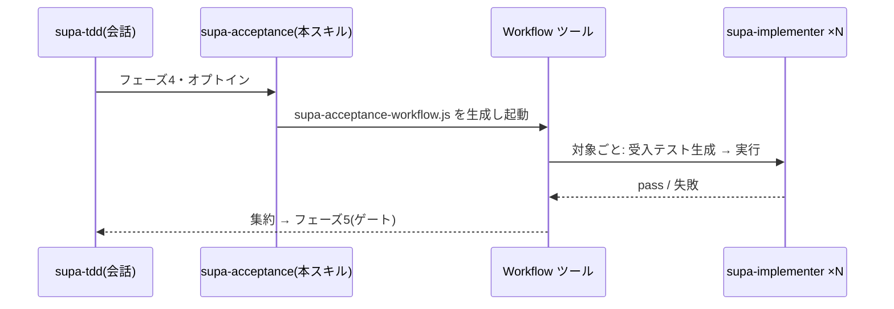

# supa-acceptance — 受入フェーズの並列 Workflow(authoring)

`supa-tdd` のフェーズ4(endpoint・end2end の**実装後の受入テスト**)を Workflow で並列化する。**雛形は同梱しない**。`.claude/workflows/supa-acceptance-workflow.js` を生成し `Workflow({ name: 'supa-acceptance-workflow' })` で起動する。

## オーケストレーション



## 使う条件
- フェーズ3まで完了(実装が green)。
- 受入対象が3つ以上:**Route Handler ごとに endpoint**、**next ルート / Expo web ごとに Playwright end2end**、**Expo 画面ごとに Maestro**。
- **ユーザーがオプトイン**。会話側がゲートを維持。駆動役は択一。

## 生成手順
1. `args` を導く(`kind` は `endpoint` / `e2e-web` / `e2e-native`)。例:
```js
const args = [
  { kind: 'endpoint',   target: 'POST /api/orders', spec: 'app/next-shop/src/endpoint/orders.spec.js' },
  { kind: 'e2e-web',    target: '/checkout',        spec: 'app/next-shop/src/end2end/checkout.spec.js' },
  { kind: 'e2e-native', target: 'Home 画面',        spec: 'app/expo-shop/src/end2end/native/home.yaml' },
];
```
2. 配置スコープ:`--scope project` なら `repo/.claude/workflows/`、既定 user なら `~/.claude/workflows/`。
3. 下記を `supa-acceptance-workflow.js` として書き起動。`args` は実 JSON。
4. 集約結果を会話へ返し **フェーズ5** へ。

## スクリプト雛形
```js
export const meta = {
  name: 'supa-acceptance-workflow',
  description: 'Route Handler に endpoint、ルート/画面に end2end を並列生成・実行',
  phases: [{ title: 'Author' }, { title: 'Run' }],
}
const VERDICT = { type: 'object', properties: { pass: { type: 'boolean' }, note: { type: 'string' } }, required: ['pass'] }
const out = await pipeline(args,
  t => agent(`${t.target} の受入テストを ${t.spec} に生成。kind=${t.kind}。` +
             `endpoint=Playwright request(共通・外部サービスは env で stub した dev サーバ・ブラウザ無し)、` +
             `e2e-web=Playwright(ブラウザ)、e2e-native=Maestro フロー(*.yaml)。` +
             `配置: endpoint=src/endpoint/、e2e-web=next は src/end2end/・Expo は src/end2end/web/、e2e-native=src/end2end/native/。`,
             { agentType: 'supa-implementer', label: `author:${t.target}`, phase: 'Author' }),
  (_, t) => agent(`${t.spec} を実行し結果を返す(endpoint/e2e-web=Playwright、e2e-native=prebuild+expo run 後に maestro test)。`,
             { label: `run:${t.target}`, phase: 'Run', schema: VERDICT }))
return { results: out.filter(Boolean) }
```

endpoint/end2end は重く非対話のため Stop フックには含めない(本 Workflow か CI で実行)。
