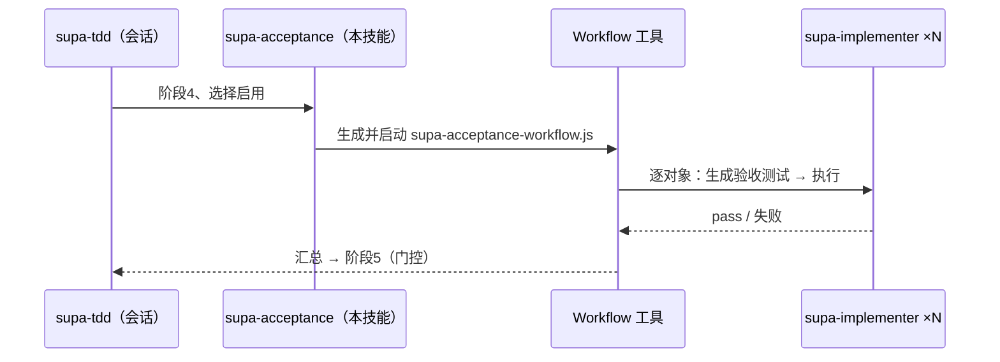

# supa-acceptance — 验收阶段的并行 Workflow（authoring）

将 `supa-tdd` 的阶段4（endpoint、end2end 的**实现后的验收测试**）以 Workflow 并行化。**不内置模板**。生成 `.claude/workflows/supa-acceptance-workflow.js` 并以 `Workflow({ name: 'supa-acceptance-workflow' })` 启动。

## 编排



## 使用条件
- 阶段3为止已完成（实现为 green）。
- 验收对象有3个以上：**每个 Route Handler 一个 endpoint**、**每个 next 路由 / Expo web 一个 Playwright end2end**、**每个 Expo 画面一个 Maestro**。
- **用户选择启用**。会话侧维持门控。驱动角色二选一。

## 生成步骤
1. 导出 `args`（`kind` 为 `endpoint` / `e2e-web` / `e2e-native`）。例：
```js
const args = [
  { kind: 'endpoint',   target: 'POST /api/orders', spec: 'app/next-shop/src/endpoint/orders.spec.js' },
  { kind: 'e2e-web',    target: '/checkout',        spec: 'app/next-shop/src/end2end/checkout.spec.js' },
  { kind: 'e2e-native', target: '主页画面',          spec: 'app/expo-shop/src/end2end/native/home.yaml' },
];
```
2. 放置范围：`--scope project` 则 `repo/.claude/workflows/`，默认 user 则 `~/.claude/workflows/`。
3. 将下述写为 `supa-acceptance-workflow.js` 并启动。`args` 为实际 JSON。
4. 将汇总结果返回会话，进入 **阶段5**。

## 脚本模板
```js
export const meta = {
  name: 'supa-acceptance-workflow',
  description: '为 Route Handler 生成 endpoint、为路由/画面生成 end2end,并行生成与执行',
  phases: [{ title: 'Author' }, { title: 'Run' }],
}
const VERDICT = { type: 'object', properties: { pass: { type: 'boolean' }, note: { type: 'string' } }, required: ['pass'] }
const out = await pipeline(args,
  t => agent(`将 ${t.target} 的验收测试生成到 ${t.spec}。kind=${t.kind}。` +
             `endpoint=Playwright request（通用、外部服务以 env stub 的 dev 服务器、无浏览器），` +
             `e2e-web=Playwright（浏览器），e2e-native=Maestro 流程（*.yaml）。` +
             `放置：endpoint=src/endpoint/，e2e-web=next 为 src/end2end/、Expo 为 src/end2end/web/，e2e-native=src/end2end/native/。`,
             { agentType: 'supa-implementer', label: `author:${t.target}`, phase: 'Author' }),
  (_, t) => agent(`执行 ${t.spec} 并返回结果（endpoint/e2e-web=Playwright，e2e-native=prebuild+expo run 后 maestro test）。`,
             { label: `run:${t.target}`, phase: 'Run', schema: VERDICT }))
return { results: out.filter(Boolean) }
```

endpoint/end2end 较重且非交互，故不纳入 Stop 钩子（以本 Workflow 或 CI 执行）。
