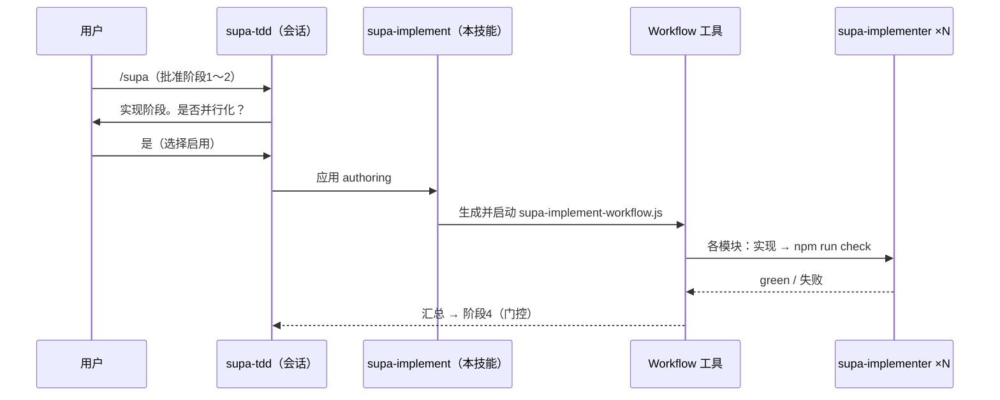

# supa-implement — 实现阶段的并行 Workflow（authoring）

将 `supa-tdd` 的阶段3 **以 Workflow 并行化**。**不内置模板**。依据本技能的指示生成 `.claude/workflows/supa-implement-workflow.js` 并以 `Workflow({ name: 'supa-implement-workflow' })` 启动。

## 编排



## 使用条件（全部满足时）
- 阶段2为止已完成（契约 + red 测试齐备）。
- **互相无 import 依赖、并行实现不会冲突的独立模块有3个以上**。
- **用户选择启用**（会话侧维持人工门控。Workflow 运行中无法人工输入）。
- 与会话内 subagent-driven **不同时并用**（驱动角色二选一）。

不满足则不做 Workflow 化，而在会话内串行实现。

## 生成步骤
1. 从含未实现桩的 `.js/.jsx` 导出 `args`（仅独立模块）。例：
```js
const args = [
  { file: 'app/next-shop/src/helper/order.js',   testFile: 'app/next-shop/src/helper/order.test.js' },
  { file: 'app/next-shop/src/helper/pricing.js', testFile: 'app/next-shop/src/helper/pricing.test.js' },
  { file: 'package/order/src/helper/money.js',    testFile: 'package/order/src/helper/money.test.js' },
];
```
2. 放置范围：install 若为 `--scope project` 则 `repo/.claude/workflows/`，默认 user 则 `~/.claude/workflows/`。
3. 将下述脚本写为 `supa-implement-workflow.js`，并以 `Workflow({ name: 'supa-implement-workflow' })` 启动。`args` 以实际 JSON 传入。
4. 将汇总结果返回会话，进入 **阶段4（门控）**。

## 脚本模板
```js
export const meta = {
  name: 'supa-implement-workflow',
  description: '并行实现已 red 的模块,验证到 npm run check 变绿为止',
  phases: [{ title: 'Implement' }, { title: 'Verify' }],
}
const VERDICT = { type: 'object', properties: { green: { type: 'boolean' }, note: { type: 'string' } }, required: ['green'] }
const out = await pipeline(args,
  m => agent(`实现 ${m.file} 的桩本体并使 ${m.testFile} 变为 green。JS+JSDoc、ESM。不改动契约（JSDoc）。不残留 throw。`,
             { agentType: 'supa-implementer', label: `impl:${m.file}`, phase: 'Implement' }),
  (_, m) => agent(`验证 ${m.file}：执行 npm run typecheck -w <workspace> && npm run test -w <workspace>（或根 npm run check）。失败则返回原因。`,
             { agentType: 'supa-implementer', label: `verify:${m.file}`, phase: 'Verify', schema: VERDICT }))
return { results: out.filter(Boolean) }
```

subagent 为 `agentType: 'supa-implementer'`（内部也应用 JSDoc / tsc / jest 的纪律）。
