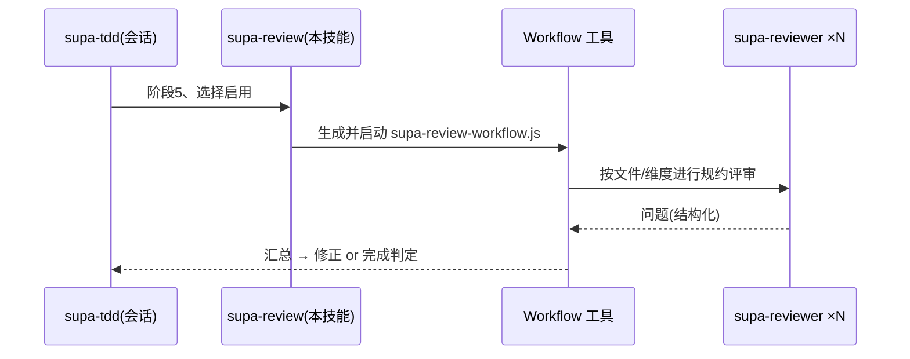

# supa-review — 评审阶段的并行 Workflow(authoring)

用 Workflow 将 `supa-tdd` 的阶段5(评审)并行化。**不内置模板**。生成 `.claude/workflows/supa-review-workflow.js` 并通过 `Workflow({ name: 'supa-review-workflow' })` 启动。一般的 code review 请直接使用 Superpowers,**需要 JS+JSDoc 规约特化时**用本技能增强。

## 编排



## 使用条件
- 变更文件 / 评审维度有多个,值得并行化。
- **用户选择启用**。由会话侧维持门控。

## 生成步骤
1. 导出 `args`(以文件为单位 or 以维度为单位)。例:
```js
const args = [
  { path: 'app/next-shop/src/helper/order.js' },
  { path: 'app/next-shop/src/action/checkout.js' },
  { aspect: '按代码类别的测试覆盖(所有路由/画面是否都有 end2end)' },
];
```
2. 放置位置范围:若 `--scope project` 则 `repo/.claude/workflows/`,默认 user 则 `~/.claude/workflows/`。
3. 将下面内容写为 `supa-review-workflow.js` 并启动。
4. 汇总问题,确认未实现的桩零残留、回归为绿后完成。

## 脚本模板
```js
export const meta = {
  name: 'supa-review-workflow',
  description: '按文件/维度并行执行 supadevops 规约评审',
  phases: [{ title: 'Review' }],
}
const FINDINGS = {
  type: 'object',
  properties: {
    findings: {
      type: 'array',
      items: {
        type: 'object',
        properties: {
          severity: { type: 'string', enum: ['重', '中', '轻'] },
          where: { type: 'string' },
          issue: { type: 'string' },
          fix: { type: 'string' },
        },
        required: ['severity', 'issue'],
      },
    },
  },
  required: ['findings'],
}
const out = await parallel(args.map(a => () =>
  agent(`按 supadevops 规约评审 ${a.path ?? a.aspect}。` +
        `点检契约优先 / 类型(tsc、jsconfig)/ 按代码类别的测试 / 放置位置 / 文件内规约 / 轻薄度 / 中立性,` +
        `并将 [严重度] 问题结构化返回。`,
        { agentType: 'supa-reviewer', label: `review:${a.path ?? a.aspect}`, phase: 'Review', schema: FINDINGS })))
return { findings: out.filter(Boolean).flatMap(r => r.findings) }
```

subagent 为 `agentType: 'supa-reviewer'`(只读,仅点检与提出问题)。
