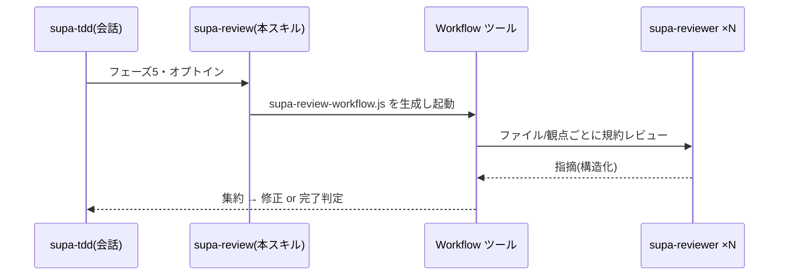

# supa-review — レビューフェーズの並列 Workflow(authoring)

`supa-tdd` のフェーズ5(レビュー)を Workflow で並列化する。**雛形は同梱しない**。`.claude/workflows/supa-review-workflow.js` を生成し `Workflow({ name: 'supa-review-workflow' })` で起動する。一般的な code review は Superpowers を直接使い、**JS+JSDoc 規約特化が要るとき**に本スキルで補強する。

## オーケストレーション



## 使う条件
- 変更ファイル / レビュー観点が複数あり、並列化に値する。
- **ユーザーがオプトイン**。会話側がゲートを維持。

## 生成手順
1. `args` を導く(ファイル単位 or 観点単位)。例:
```js
const args = [
  { path: 'app/next-shop/src/helper/order.js' },
  { path: 'app/next-shop/src/action/checkout.js' },
  { aspect: 'コード種別ごとのテスト網羅(全ルート/画面に end2end があるか)' },
];
```
2. 配置スコープ:`--scope project` なら `repo/.claude/workflows/`、既定 user なら `~/.claude/workflows/`。
3. 下記を `supa-review-workflow.js` として書き起動。
4. 指摘を集約し、未実装スタブ残存ゼロ・回帰緑を確認して完了。

## スクリプト雛形
```js
export const meta = {
  name: 'supa-review-workflow',
  description: 'ファイル/観点ごとに supadevops 規約レビューを並列実行',
  phases: [{ title: 'Review' }],
}
const FINDINGS = {
  type: 'object',
  properties: {
    findings: {
      type: 'array',
      items: {
        type: 'object',
        properties: {
          severity: { type: 'string', enum: ['重', '中', '軽'] },
          where: { type: 'string' },
          issue: { type: 'string' },
          fix: { type: 'string' },
        },
        required: ['severity', 'issue'],
      },
    },
  },
  required: ['findings'],
}
const out = await parallel(args.map(a => () =>
  agent(`${a.path ?? a.aspect} を supadevops 規約でレビュー。` +
        `契約優先 / 型(tsc・jsconfig)/ コード種別ごとのテスト / 配置 / ファイル内規約 / 薄さ / 中立性を点検し、` +
        `[重大度] 指摘を構造化して返す。`,
        { agentType: 'supa-reviewer', label: `review:${a.path ?? a.aspect}`, phase: 'Review', schema: FINDINGS })))
return { findings: out.filter(Boolean).flatMap(r => r.findings) }
```

subagent は `agentType: 'supa-reviewer'`(読み取り専用で点検・指摘のみ)。
