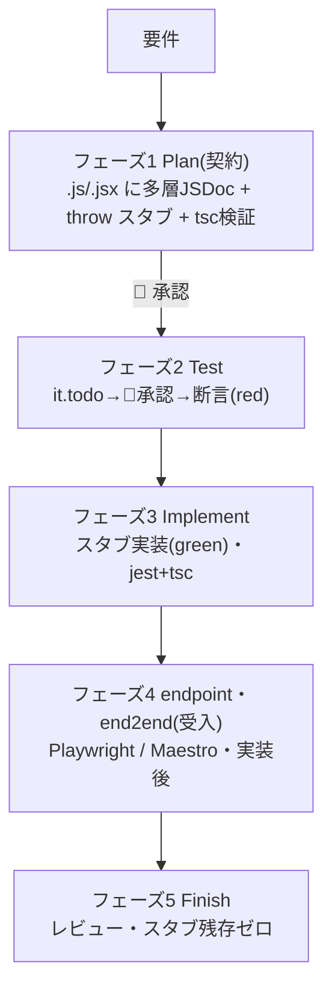
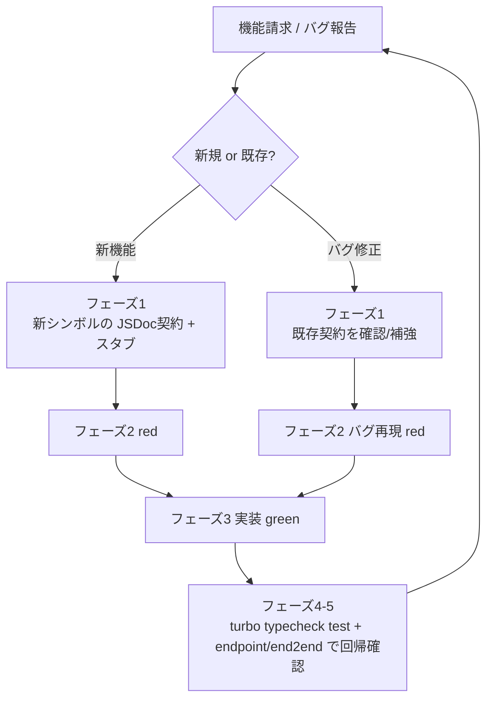

# supadevops — JSDoc 契約優先 + TDD 開発フロー

実装より先に **JSDoc 契約**を確定し、テストと実装をそこへ収束させる。**順序を飛ばさない。** 本スキルが supadevops 規律(契約優先 + TDD)の作業仕様であり、これ単体で完結する。

## 前提
- **JavaScript + JSDoc**(TypeScript 構文は書かない)。型はすべて JSDoc。`.d.ts` は作らない。型検査は `tsc -p jsconfig.json --noEmit`。
- **ESM**(各ワークスペースの `package.json` に `"type":"module"`)。
- 対象は **npm workspaces + turborepo のモノレポ**。`app/next-<名>`(Next.js `src/app`)・`app/expo-<名>`(Expo Router も `src/app`)・`package/*`(共有ライブラリ=プラットフォーム非依存ロジック/型のみ)。無ければ先に **`/supa-init`**。
- テスト:単体 = Jest(Expo は jest-expo)/ endpoint = Playwright `request` / end2end = Playwright(web・Expo web)・Maestro(Expo native)。

## 設計原則
契約優先 / 多層・詳細な JSDoc / Plan は実ファイルを直接生成(別 manifest なし) / 粒度はモジュール単位 / 進捗は実ファイル(`throw` スタブ)に現れる / ヒューマンゲート / Superpowers を補強。

## 5フェーズとゲート



| フェーズ | 作業 | ゲート |
|---|---|---|
| **1 Plan(契約)** | 対象 `.js/.jsx` に多層 JSDoc(module/class/function/method/component props/`@typedef`)+ 構造プレースホルダ(本体 `throw new Error('not implemented')`)を直接記入。`tsc -p jsconfig.json --noEmit` で型契約を検証 | 🚧 **承認** |
| **2 Test(red)** | JSDoc 契約に対し Jest を書く。**`it.todo` で検証項目を列挙** → 🚧承認 → 断言を埋めて **red** | 🚧 **承認(it.todo)** |
| **3 Implement(green)** | スタブ本体を**モジュール単位**で実装し `jest` + `tsc` を緑に | — |
| **4 受入(endpoint・end2end)** | 実装後に Playwright/Maestro で追加(後述) | — |
| **5 Finish** | レビューし、未実装スタブが残っていないことを確認 | — |

**ゲートは会話側で維持する。** フェーズ1とフェーズ2の `it.todo` 列挙後は、ユーザー承認を得るまで次へ進まない。

## 契約の検証 — 3系統
- **型**(`tsc`)— フェーズ1直後から常時。
- **振る舞い**(Jest:ヘルパー・Server Action・Expo ロジック・共有ライブラリ)— フェーズ2 red → フェーズ3 green。
- **外部受入**(endpoint・end2end)— フェーズ4(実装後の受入)。
- **test-first は Jest 対象に限る。** endpoint・end2end は実装後の受入テスト。

## コード種別ごとのテスト — 役割・デプロイ先に依らない

| コード種別 | 振る舞いテスト |
|---|---|
| ヘルパー(`src/helper/`)・共有ライブラリ(`package/*`) | **Jest 単体** |
| Server Action(`src/action/`) | **Jest**(共通・外部サービスの HTTP は MSW で mock。純粋部は helper へ) |
| Route Handler(`src/app/api/`) | **endpoint**(Playwright `request`・共通/外部サービスは env で stub した dev サーバ) |
| React コンポーネント / page / layout(next UI) | **end2end(Playwright)** |
| Expo ロジック(`app/expo-*/src/`) | **Jest(jest-expo)** |
| Expo UI web | **end2end(Playwright)** / Expo UI native | **end2end(Maestro)** |

- **全 next ルート(page/layout)と Expo 全画面を例外なく end2end の対象**にする。
- RTL / jsdom は**使わない**。Route Handler・Server Action・UI は薄く保ち、決定的処理は helper へ抽出して Jest で固める。
- **共通サービス**(自社内部共有)と **外部サービス**(第三者)は別概念。両者ともテストで stub/mock。

## 規約(ファイル内順序・テスト配置・型チェック)
- **ファイル内順序**:`// @ts-check` → import → `@typedef` → export 関数/class → 非公開 helper。説明は **JSDoc のみ**(対象の直上行)。挙動説明の行内 `//` は書かない(例外は `// @ts-check`・`'use server'`/`'use client'` のみ)。
- **テスト配置**:業務ファイルに混ぜず別ファイル。単体は実装の隣 `<name>.test.js`。endpoint=`src/endpoint/`、end2end(web)=`src/end2end/`(Expo は `src/end2end/web/`)、Maestro=`src/end2end/native/*.yaml`。
- **型チェック**:ワークスペース毎の `jsconfig.json`(`allowJs`/`checkJs`/`noEmit`/`jsx`/`types:["node"]`)。テスト型は import 由来(`@jest/globals` / `@playwright/test`)。

## 記入例

**フェーズ1:契約スタブ**(`src/helper/order.js`)— 型と意図を JSDoc に、本体は `throw`:
```js
// @ts-check

/**
 * 注文の金額計算・検証ヘルパー(純粋関数)。
 * @module helper/order
 */

/**
 * @typedef {object} OrderItem
 * @property {string} sku - 商品コード
 * @property {number} qty - 数量(>=1)
 */

/**
 * 明細から新規注文を組み立てる(純粋。永続化はしない)。
 * @param {OrderItem[]} items - 1件以上の明細
 * @returns {{ items: OrderItem[], total: number, status: 'pending' }} 新規注文
 * @throws {RangeError} items が空のとき
 */
export function buildOrder(items) {
  throw new Error('not implemented');
}
```

**フェーズ2前半:`it.todo` 列挙**(🚧 承認待ち):
```js
import { describe, it } from '@jest/globals';
describe('buildOrder', () => {
  it.todo('明細から注文を構築し status は pending');
  it.todo('items が空なら RangeError を投げる');
});
```

**フェーズ2後半:断言を埋めて red**(`src/helper/order.test.js`)。型は再利用値(factory)にのみ付ける:
```js
// @ts-check
import { describe, it, expect } from '@jest/globals';
import { buildOrder } from './order.js';

/** @param {Partial<import('./order.js').OrderItem>} [o] @returns {import('./order.js').OrderItem} */
const makeItem = (o = {}) => ({ sku: 'A1', qty: 1, ...o });

describe('buildOrder', () => {
  it('明細から注文を構築し status は pending', () => {
    expect(buildOrder([makeItem()]).status).toBe('pending');
  });
  it('items が空なら RangeError を投げる', () => {
    expect(() => buildOrder([])).toThrow(RangeError);
  });
});
```

**コンポーネント / Server Action のスタブ**(props も JSDoc・本体 `throw`):
```jsx
// @ts-check
/** @param {{ order: import('@/type/order').Order, onCancel: () => void }} props */
export function OrderCard({ order, onCancel }) {
  throw new Error('not implemented');
}
```
```js
// @ts-check
'use server';
/**
 * 確定した注文を共通サービスへ送る。
 * @param {import('@/type/order').OrderItem[]} items
 * @returns {Promise<{ id: string }>}
 */
export async function checkout(items) {
  throw new Error('not implemented');
}
```

**Server Action のテスト**(関数として Jest・共通/外部サービスは MSW で mock):
```js
// @ts-check
import { describe, it, expect, beforeAll, afterAll } from '@jest/globals';
import { setupServer } from 'msw/node';
import { http, HttpResponse } from 'msw';
import { checkout } from './checkout.js';

const server = setupServer(
  http.post('https://order.internal/orders', () => HttpResponse.json({ id: 'o1' })),
);
beforeAll(() => server.listen());
afterAll(() => server.close());

describe('checkout', () => {
  it('注文を共通サービスへ送り id を返す', async () => {
    expect((await checkout([{ sku: 'A1', qty: 1 }])).id).toBe('o1');
  });
});
```

**フェーズ4:endpoint**(`src/endpoint/orders.spec.js`・ブラウザ無し):
```js
// @ts-check
import { test, expect } from '@playwright/test';
test('POST /api/orders は注文を作成する', async ({ request }) => {
  const res = await request.post('/api/orders', { data: { items: [{ sku: 'A1', qty: 1 }] } });
  expect(res.status()).toBe(201);
});
```

## 反復サイクルと回帰安全



機能請求・バグ修正ごとに全フローを1サイクル。**新機能**=契約→red→green→回帰確認。**バグ修正**=既存契約を確認(穴があれば JSDoc 補強)→バグ再現の red→修正 green→回帰確認。完了前に **`turbo run typecheck test`**(全 workspace の tsc + jest)を緑にする(Stop フックが自動確認)。endpoint/end2end はフェーズ4で実行(Stop には含めない)。修正したバグは red→green テストで恒久化。

## Superpowers との関係 / 駆動役
- 規律(JSDoc 契約優先 + Superpowers TDD)は**常に併用**。
- 実装の駆動役だけ択一:**① 会話内 subagent-driven(既定)** / **② supadevops Workflow 並列(任意)**。同じモジュール群に ① と ② を同時に走らせない。
- code review は Superpowers を直接使い、JS+JSDoc 特化が要れば `supa-reviewer` で補強。

## 並列加速(任意・オプトイン)
実行フェーズ(3 実装 / 4 受入 / 5 レビュー)で **独立モジュールが3つ以上**あり、ユーザーが望む場合のみ、対応スキルで Workflow を生成・起動して並列化する:
- フェーズ3 → **`supa-implement`** スキル
- フェーズ4 → **`supa-acceptance`** スキル
- フェーズ5 → **`supa-review`** スキル

1 Workflow = 1フェーズ(走行中は人間入力不可のため)。ヒューマンゲートは会話側が維持する。
