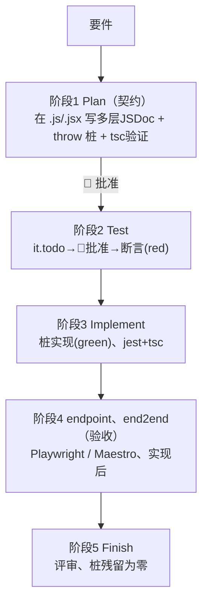
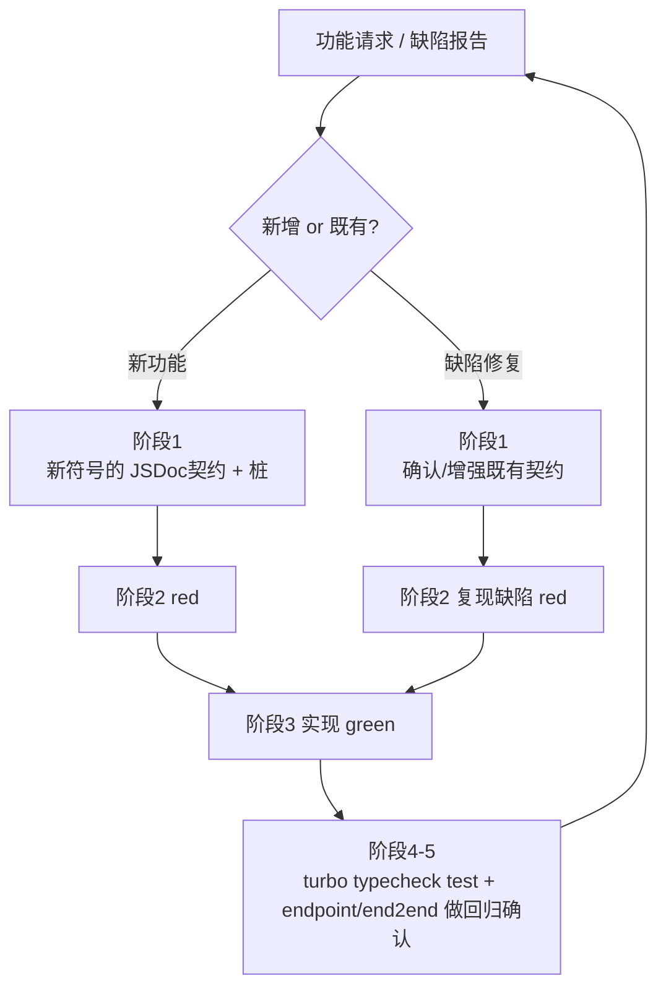

# supadevops — JSDoc 契约优先 + TDD 开发流

先于实现确定 **JSDoc 契约**，并让测试与实现向其收敛。**不要跳过顺序。** 本技能即 supadevops 纪律（契约优先 + TDD）的作业规约，单凭它即可自洽完结。

## 前提
- **JavaScript + JSDoc**（不写 TypeScript 构文）。类型全部使用 JSDoc。不创建 `.d.ts`。类型检查为 `tsc -p jsconfig.json --noEmit`。
- **ESM**（各 workspace 的 `package.json` 中 `"type":"module"`）。
- 对象为 **npm workspaces + turborepo 的 monorepo**。`app/next-<名>`（Next.js `src/app`）、`app/expo-<名>`（Expo Router 同为 `src/app`）、`package/*`（共享库＝与平台无关的逻辑/类型）。若无则先执行 **`/supa-init`**。
- 测试：单元 = Jest（Expo 为 jest-expo）/ endpoint = Playwright `request` / end2end = Playwright（web、Expo web）、Maestro（Expo native）。

## 设计原则
契约优先 / 多层、详细的 JSDoc / Plan 直接生成实文件（无另设 manifest）/ 粒度为模块单位 / 进度体现在实文件（`throw` 桩）/ 人工门控 / 增强 Superpowers。

## 5 阶段与门控



| 阶段 | 作业 | 门控 |
|---|---|---|
| **1 Plan（契约）** | 在对象 `.js/.jsx` 直接写入多层 JSDoc（module/class/function/method/component props/`@typedef`）+ 结构占位（本体 `throw new Error('not implemented')`）。以 `tsc -p jsconfig.json --noEmit` 验证类型契约 | 🚧 **批准** |
| **2 Test（red）** | 针对 JSDoc 契约写 Jest。**用 `it.todo` 列举验证项** → 🚧批准 → 填入断言得到 **red** | 🚧 **批准（it.todo）** |
| **3 Implement（green）** | 以**模块单位**实现桩本体，让 `jest` + `tsc` 转绿 | — |
| **4 验收（endpoint、end2end）** | 实现后用 Playwright/Maestro 追加（后述） | — |
| **5 Finish** | 评审，并确认没有遗留未实现的桩 | — |

**门控由会话侧维持。** 阶段1与阶段2的 `it.todo` 列举之后，在获得用户批准前不向下推进。

## 契约的验证 — 3 系统
- **类型**（`tsc`）— 自阶段1之后持续进行。
- **行为**（Jest：辅助函数、Server Action、Expo 逻辑、共享库）— 阶段2 red → 阶段3 green。
- **外部验收**（endpoint、end2end）— 阶段4（实现后的验收）。
- **test-first 仅限 Jest 对象。** endpoint、end2end 为实现后的验收测试。

## 按代码种类的测试 — 不依赖角色、部署目标

| 代码种类 | 行为测试 |
|---|---|
| 辅助函数（`src/helper/`）、共享库（`package/*`） | **Jest 单元** |
| Server Action（`src/action/`） | **Jest**（公共服务、外部服务的 HTTP 用 MSW mock。纯逻辑部分抽到 helper） |
| Route Handler（`src/app/api/`） | **endpoint**（Playwright `request`、公共/外部服务用 env 桩化的 dev 服务器） |
| React 组件 / page / layout（next UI） | **end2end（Playwright）** |
| Expo 逻辑（`app/expo-*/src/`） | **Jest（jest-expo）** |
| Expo UI web | **end2end（Playwright）** / Expo UI native | **end2end（Maestro）** |
| GAS 业务逻辑（`app/gas-*/src/helper`·`src/action`） | **Jest 单元**（GAS 运行时不跑 Jest：逻辑抽到 helper/共享库测试，经 `vendor-pack.js`→esbuild→`src/app/vendor.js` 注入运行时；`src/app` 的 GAS 入口 doGet/触发器保持薄壳） |

- **统一的 `src/app` 模型**：三类应用一致——`src/app` = 平台入口（next 路由 / Expo 画面 / GAS push 入口），保持薄壳；`src/helper`·`src/action`·`src/type` = 纯逻辑，用 Jest 固化。
- **将全部 next 路由（page/layout）与 Expo 全部画面无一例外地纳入 end2end 对象**。
- **不使用** RTL / jsdom。Route Handler、Server Action、UI 保持轻薄，确定性处理抽出到 helper 并用 Jest 固化。
- **公共服务**（自有内部共享）与 **外部服务**（第三方）是不同概念。两者均在测试中 stub/mock。

## 规约（文件内顺序、测试放置位置、类型检查）
- **文件内顺序**：import → `@typedef` → export 函数/class → 非公开 helper。说明**仅用多行块 JSDoc**（`/**` / ` * @tag …` / ` */` 各占一行，位于对象正上方；不写一行式 `/** @type {X} */`、也不写在代码同行末尾）。不写说明行为的行内 `//`（例外仅为 `'use server'`/`'use client'`）。
- **测试放置位置**：不与业务文件混放，使用独立文件。单元置于实现旁的 `<name>.test.js`。endpoint=`src/endpoint/`、end2end（web）=`src/end2end/`（Expo 为 `src/end2end/web/`）、Maestro=`src/end2end/native/*.yaml`。
- **类型检查**：每个 workspace 的 `jsconfig.json`（`allowJs`/`checkJs`/`noEmit`/`jsx`/`types`）。`checkJs:true` 一括检查 include（`src`）内全部 `.js/.jsx`。**不使用 per-file `// @ts-check`**（统一由 `checkJs` 把关）；include 外的配置/脚本（`jest.config.js` / `next.config.js` / `playwright.config.js` / `babel`·`metro.config.cjs` 等）不纳入类型检查（trivial，可接受）。扩展名：**ESM 为默认——`type:module` 下一律 `.js`**；`.mjs` 仅用于不被 `type:module` 覆盖的独立脚本（如插件的 `scripts/*.mjs`）；`.cjs` 仅用于「同步加载、不接受 ESM」的工具配置——Expo 的 `babel.config`（Babel 同步加载 ESM 会抛 "only supported when running Babel asynchronously"）与 `metro.config`（Metro 同步 require）。测试类型来自 import（`@jest/globals` / `@playwright/test`）。
- **跨 workspace 的类型复用**：要在别 workspace 引用某库的 `@typedef`，须在**该库入口 `package/<lib>/src/index.js` 再声明**——`export { fn } from './helper/x.js'` 只再导出值、不带出其 `@typedef`，且 `exports` 仅暴露 `"."` 故 deep import 被禁。每个 `@typedef` 独占一个 JSDoc 块（同块多个会触发 TS8021）：
```js
/**
 * @typedef {import('./helper/order.js').OrderItem} OrderItem
 */
```

## 填写示例

**阶段1：契约桩**（`src/helper/order.js`）— 类型与意图写入 JSDoc，本体为 `throw`：
```js
/**
 * 订单的金额计算、验证辅助函数（纯函数）。
 * @module helper/order
 */

/**
 * @typedef {object} OrderItem
 * @property {string} sku - 商品代码
 * @property {number} qty - 数量（>=1）
 */

/**
 * 从明细组装新订单（纯函数。不做持久化）。
 * @param {OrderItem[]} items - 1 条以上的明细
 * @returns {{ items: OrderItem[], total: number, status: 'pending' }} 新订单
 * @throws {RangeError} 当 items 为空时
 */
export function buildOrder(items) {
  throw new Error('not implemented');
}
```

**阶段2前半：`it.todo` 列举**（🚧 等待批准）：
```js
import { describe, it } from '@jest/globals';
describe('buildOrder', () => {
  it.todo('从明细构建订单且 status 为 pending');
  it.todo('items 为空则抛出 RangeError');
});
```

**阶段2后半：填入断言得到 red**（`src/helper/order.test.js`）。类型仅标注在复用值（factory）上：
```js
import { describe, it, expect } from '@jest/globals';
import { buildOrder } from './order.js';

/**
 * @param {Partial<import('./order.js').OrderItem>} [o]
 * @returns {import('./order.js').OrderItem}
 */
const makeItem = (o = {}) => ({ sku: 'A1', qty: 1, ...o });

describe('buildOrder', () => {
  it('从明细构建订单且 status 为 pending', () => {
    expect(buildOrder([makeItem()]).status).toBe('pending');
  });
  it('items 为空则抛出 RangeError', () => {
    expect(() => buildOrder([])).toThrow(RangeError);
  });
});
```

**组件 / Server Action 的桩**（props 也用 JSDoc、本体 `throw`）：
```jsx
/**
 * @param {{ order: import('@/type/order').Order, onCancel: () => void }} props
 */
export function OrderCard({ order, onCancel }) {
  throw new Error('not implemented');
}
```
```js
'use server';
/**
 * 将已确定的订单发送至公共服务。
 * @param {import('@/type/order').OrderItem[]} items
 * @returns {Promise<{ id: string }>}
 */
export async function checkout(items) {
  throw new Error('not implemented');
}
```

**Server Action 的测试**（作为函数用 Jest、公共/外部服务用 MSW mock）：
```js
import { describe, it, expect, beforeAll, afterAll } from '@jest/globals';
import { setupServer } from 'msw/node';
import { http, HttpResponse } from 'msw';
import { checkout } from './checkout.js';

const server = setupServer(
  http.post('https://order.internal/orders', () => HttpResponse.json({ id: 'o1' })),
);
beforeAll(() => server.listen());
afterAll(() => server.close());

describe('checkout', () => {
  it('将订单发送至公共服务并返回 id', async () => {
    expect((await checkout([{ sku: 'A1', qty: 1 }])).id).toBe('o1');
  });
});
```

**阶段4：endpoint**（`src/endpoint/orders.spec.js`、无浏览器）：
```js
import { test, expect } from '@playwright/test';
test('POST /api/orders 创建订单', async ({ request }) => {
  const res = await request.post('/api/orders', { data: { items: [{ sku: 'A1', qty: 1 }] } });
  expect(res.status()).toBe(201);
});
```

endpoint/end2end 需要 `playwright.config.js`（最小骨架；在 `src` 之外，不纳入 `tsc -p jsconfig.json` 类型检查）。jest 只匹配 `*.test.js`，`*.spec.js` 不与单测冲突：
```js
import { defineConfig } from '@playwright/test';
export default defineConfig({
  testDir: './src/endpoint',
  use: { baseURL: 'http://127.0.0.1:3100' },
  webServer: { command: 'npm run dev -- -p 3100', url: 'http://127.0.0.1:3100', timeout: 120_000 },
});
```
公共/外部服务以 dev 服务器启动时的 env 桩化（不在测试进程内 mock）。

## 迭代循环与回归安全



每个功能请求、缺陷修复都走完整流的一轮循环。**新功能**＝契约→red→green→回归确认。**缺陷修复**＝确认既有契约（若有缺口则增强 JSDoc）→复现缺陷的 red→修复 green→回归确认。完成前让 **`turbo run typecheck test`**（全 workspace 的 tsc + jest）转绿（Stop 钩子自动确认）。endpoint/end2end 在阶段4执行（不计入 Stop）。修复的缺陷以 red→green 测试固化。

## 与 Superpowers 的关系 / 驱动角色
- 纪律（JSDoc 契约优先 + Superpowers TDD）**始终并用**。
- 仅实现的驱动角色二选一：**① 会话内 subagent-driven（默认）** / **② supadevops Workflow 并行（可选）**。不要对同一组模块同时跑 ① 与 ②。
- code review 直接使用 Superpowers，若需 JS+JSDoc 专化则以 `supa-reviewer` 增强。

## 并行加速（可选、选择启用，opt-in）
仅当执行阶段（3 实现 / 4 验收 / 5 评审）存在 **3 个以上独立模块**且用户希望时，用对应技能生成、启动 Workflow 进行并行化：
- 阶段3 → **`supa-implement`** 技能
- 阶段4 → **`supa-acceptance`** 技能
- 阶段5 → **`supa-review`** 技能

1 Workflow = 1 阶段（因运行中无法接受人工输入）。人工门控由会话侧维持。
